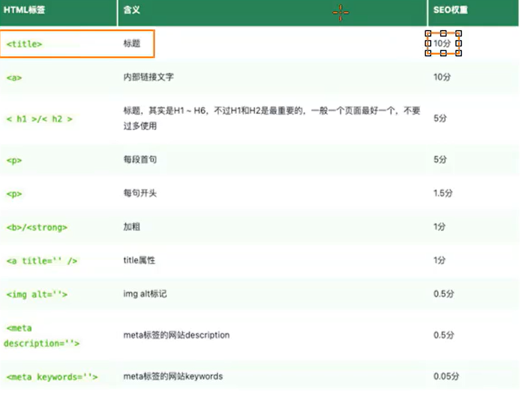

# spa、ssr及ssg区别及优缺点
## spa
单页应用程序（spa）全程Single-page application,SPA应用是在客户端呈现的(Client Side Render)CSR.
- SPA应用默认只返回一个空的html页面
- 整个应用程序的内容都是通过javascript动态加载的
- 构建SPA应用常见的框架有React,AngularJS,VueJs等，就是我们最常写的方式。
SPA优点如下：
1. 只需加载一次：页面切换时只需切换前端路由，不需要重新加载页面，页面切换速度比较快。
2. 更好的用户体验：SPA提供类似于桌面或移动应用程序的体验，体验流畅。
3. 可轻松构建功能丰富的Web应用程序，个人感觉用法比较简单。
但是这种渲染方式在浏览器的渲染顺序是：用户点开网站 -> 浏览器向服务器请求资源 -> 服务器返回一个空白的html文件，此时浏览器上的页面是空白的 -> 浏览器根据html里的script标签再向服务器请求js文件，此时浏览器仍是白屏状态 -> 浏览器下载并加载js文件，此时仍是白屏 -> 加载所有js文件，成功渲染，将页面渲染给用户。
由上面的步骤我们可以看到这种应用程序首屏渲染速度相当慢，并且对SEO不友好。
## SEO
以Google爬虫流程为例：首先从索引区出发抓取网页，再将抓取到的网页放到临时库中处理，对于设置了不可爬虫等的网页，会清理掉，符合爬虫规则的网页会被放到索引区进行分类，归档，排序，然后将结果返回给用户，对于网页中引用的其他网页，会存入临时库，不断循环这个流程。所以，首页包含的关键词句越多，爬到的信息越多，就会更容易被用户检索到进而增加浏览量。而上面所说的SPA首页包含的信息相当少，所以对SEO非常不友好。
下面是对于SEO的加分项：

最好是每个页面都有对应的title,同一个网站所有页面都有内链指向首页，
meta标签优化：设置description、keywords、alt、title属性等。
除此之外，我们还可以设置robots.txt文件，规定爬虫可以爬取网站上哪些网址，sitemap.xml文件，在站点地图列出所有网页，确保爬虫不会漏掉某些网页。
## SSG
静态网站生成（SSG）全称是Static Site Generate，是预先生成好的静态网站。
- SSG一般在构建阶段就已经提前生成好了。
- 如果网站的内容更新了，就需要再次构建和部署。
- 常见框架：Vue Nuxt、React Next.js等。
SSG优点如下：
- 访问速度非常快，因为每个页面在构建阶段就已经提前生成好了。
- 直接给浏览器返回SEO，也有利于SEO。
- 依然保留了SPA应用的特性，比如：前端路由响应式数据、虚拟DOM等。
SSG缺点:
- 页面都是静态的，不利于展示实时性的内容，这方面SSR更优。
- 每次更新都需要重新构建和部署。
## SSR
服务器端渲染全程是Server Side Render,在服务器渲染页面，并将渲染好的HTML返回给浏览器呈现。
常见框架有Vue Nuxt、React Next.js等。
SSR的流程是：用户在浏览器访问网址 -> 浏览器向服务器发送请求,此时白屏 -> 服务器返回静态页面，服务器渲染出页面，此时用户就可见页面了，只是按钮等无法交互 -> 浏览器下载js文件，此时经历hydration流程，激活页面。
由此可见SSR渲染的首屏渲染速度比SPA快，因为html和js分开了。而且浏览器直接渲染服务器返回的完整html，对首屏渲染速度也很友好。
SSR缺点如下：
1. SSR通常需要更多API调用，会消耗更多服务器资源，成本高。
2. 增加了一定开发成本，需要关心哪些代码在服务器端运行，哪些在浏览器端运行。
3. SSR配置站点缓存通常会比SPA站点要复杂一点。

SSR应用场景相当广阔：
- SaaS产品（无需安装，打开浏览器（或轻量客户端）输入账号密码，直接在线使用）：电子邮件网站、在线游戏、用户关系管理系统（CRM）、采购系统。
- 门户网站、电子商务、零售网站。
- 单个页面、静态网站、文档类网站...