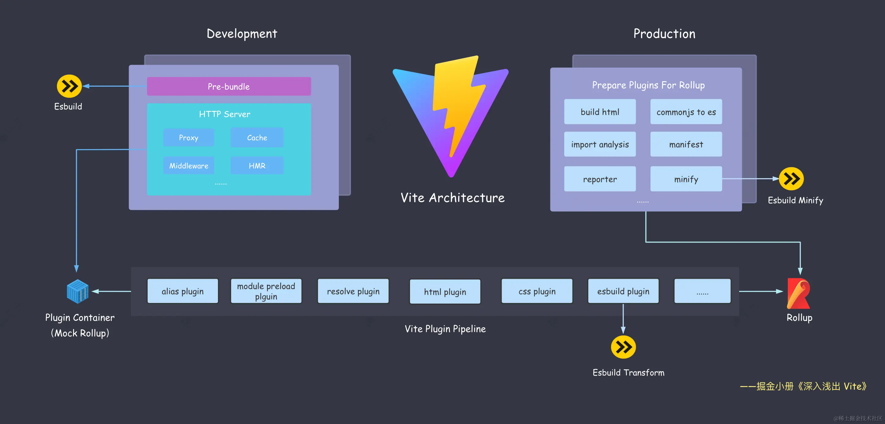

# vite

## 前端工程化痛点及解决方案

1. 模块化需求：
   提供模块加载方案，并兼容不同的模块规范
2. 兼容浏览器，编译高级语法
   配合 Sass、TSC、Babel 等前端工具链，完成高级语法的转译功能，同时对于静态资源也能进行处理，使之能作为一个模块正常加载。
3. 线上代码的质量问题，考虑代码运行时的性能问题
   生产环境配合 Terser 等压缩工具进行代码压缩和混淆，通过 Tree Shaking 删除未使用的代码，提供对于低版本浏览器的语法降级处理等等。
4. 开发效率，项目的冷启动/二次启动时间、热更新时间
   构建工具性能优化

## vite 简介

vite 是一种新型前端构建工具，Vite 能将项目的启动性能提升一个量级，并且达到毫秒级的瞬间热更新效果。
它主要由两部分组成：
一个开发服务器，它基于**原生 ES 模块**提供了丰富的内建功能，在开发过程中，Vite 假设使用的是现代浏览器。这意味着该浏览器支持大多数最新的 JavaScript 和 CSS 功能。因此，Vite 将 esnext 设置为转换目标。基于浏览器原生 ESM 的支持实现了 no-bundle 服务。这可以**防止语法降低**，使 Vite 能够尽可能接近原始源代码提供模块。这就是 vite 构建速度快原因之一。在开发环境做第三方库构建和 TS/JSX 语法编译时，vite 采用<a href='./esbuild.md'>esbuild</a>，一个基于 Go 语言的打包工具，打包速度快。

一套构建指令，在生产打包时，Vite 采用了<a href='./rollup.md'>Rollup</a>灵活的插件 API 和基础建设，能够输出高度优化的静态资源。虽然 Rollup 速度没有 esbuild 快，但它已经开始着手改进性能，在 v4 中将其解析器切换到<a href='../语法转换编译类/swc.md'>SWC</a>。同时还有一个正在进行中的工作，即构建一个名为<a href='./rolldown.md'> Rolldown </a>的 Rust 版本的 Rollup。一旦 Rolldown 准备就绪，它就可以在 Vite 中取代 Rollup 和 esbuild，显著提高构建性能，并消除开发和构建之间的不一致性。

## vite 的基本使用

因为 vite 采用预配置的方式，所以使用 vite 时，需要配置的地方少之又少，基本开箱即用。
下面是 vite 使用时安装的一些环境及命令，可以看到 vite 并不需要配置太多的插件，内部已经完善好了。命令也相当简单。
[手动构建 vite 项目示例](https://github.com/ManMan3392/redrockhomework/tree/main/vite)
除此之外，我们还可以运用 vite 的脚手架创建项目，甚至连上述简单的配置都不需要我们完成。

```js
pnpm create vite
```

## 双引擎机制

### esbild
1. 开发预构建
   不预构建的问题
   - 如果让vite直接发送网络请求拿到第三方库的包，会引发数据瀑布流问题，每个import就是一个文件请求，但是 Chrome 对同一个域名下只能同时支持 6 个 HTTP 并发请求的限制，会导致页面加载十分缓慢。
   - 很多第三方库的打包都不是es版的，而vite是基于浏览器原生 ES 模块规范实现的 Dev Server，所以他们没有办法直接在vite里跑。
  所以vite使用esbuild来进行依赖预构建，虽然esbuild因基于go语言开发等原因有极快的打包速度，但他也有很多缺点：
  - 不支持降级到 ES5 的代码。这意味着在低端浏览器代码会跑不起来。
  - 不支持 const enum 等语法。这意味着单独使用这些语法在 esbuild 中会直接抛错。
  - 不提供操作打包产物的接口，像 Rollup 中灵活处理打包产物的能力(如renderChunk钩子)在 Esbuild 当中完全没有。
  - 不支持自定义 Code Splitting 策略。传统的 Webpack 和 Rollup 都提供了自定义拆包策略的 API，而 Esbuild 并未提供，从而降级了拆包优化的灵活性。
  所以vite在生产环境选择使用更成熟全面的打包工具rollup。
  
2. 单文件编译工具(ts/jsx)
   在 TS(X)/JS(X) 单文件编译上面，Vite 也使用 Esbuild 进行语法转译，也就是将 Esbuild 作为 Transformer 来用。但是Esbuild 并没有实现 TS 的类型系统，在编译ts时会抹掉相关代码，所以vite选择先用tsc实现类型检查，只输出错误但是不生成对应的js产物。
3. 代码压缩
   生产环境中 Esbuild 压缩器通过插件的形式融入到了 Rollup 的打包流程中。
   相比于传统的压缩工具类似于terser,esbuild有很大的速度优势，理由如下：
   - 压缩这项工作涉及大量 AST 操作，并且在传统的构建流程中，AST 在各个工具之间无法共享，比如 Terser 就无法与 Babel 共享同一个 AST，造成了很多重复解析的过程。但esbuild从头到尾都使用共享 AST 。
   - JS 本身属于解释性 + JIT（即时编译） 的语言，对于压缩这种 CPU 密集型的工作，其性能远远比不上 Golang 这种原生语言。


### rollup
是 Vite 用作生产环境打包的核心工具，也直接决定了 Vite 插件机制的设计。
1. 生产环境的bundle
   尽管esm得到了大部分浏览器的支持，但是生产环境为了适配市面上的浏览器，vite还是使用了rollup进行打包，并基于 Rollup 本身成熟的打包能力进行扩展和优化。
   主要体现在下面三个方面：
   - CSS 代码分割。如果某个异步模块中引入了一些 CSS 代码，Vite 就会自动将这些 CSS 抽取出来生成单独的文件，提高线上产物的缓存复用率。
   - 自动预加载。vite自动为入口 chunk 的依赖自动生成预加载标签<link rel="modulepreload">,会让浏览器提前下载好资源，优化页面性能。
   - 异步 Chunk 加载优化。一般情况下，在异步引入的 Chunk 中,浏览器碰见请求后才加载被依赖的模块，但是vite优化后，可以在加载模块时自动预加载他依赖的模块，节省不必要的网络开销。
2. 兼容插件机制
   在开发阶段，Vite 借鉴了 WMR 的思路，自己实现了一个 Plugin Container，用来模拟 Rollup 调度各个 Vite 插件的执行逻辑，而 Vite 的插件写法完全兼容 Rollup，因此在生产环境中将所有的 Vite 插件传入 Rollup 也没有问题。 Vite 的做法是从头到尾根植于的 Rollup 的生态，设计了和 Rollup 非常吻合的插件机制。

## vite中的hmr
### HMR 简介
HMR 的全称叫做Hot Module Replacement，即模块热替换或者模块热更新。就是在页面模块更新的时候，直接把页面中发生变化的模块替换为新的模块，同时不会影响其它模块的正常运作。正常情况下，vite检测到代码更新了会全局刷新，就是将所有逻辑重新跑一遍，这样很耗时且浪费性能。
### vite中的hmr
这套 HMR 系统基于原生的 ESM 模块规范来实现，在文件发生改变时 Vite 会侦测到相应 ES 模块的变化，从而触发相应的 API，实现局部的更新。
import.meta对象为现代浏览器原生的一个内置对象，Vite 所做的事情就是在这个对象上的 hot 属性中定义了一套完整的属性和方法。因此，可以通过import.meta.hot来访问关于 HMR 的这些属性和方法。
类型定义如下：
```ts
interface ImportMeta {
  readonly hot?: {
    readonly data: any
    accept(): void
    accept(cb: (mod: any) => void): void
    accept(dep: string, cb: (mod: any) => void): void
    accept(deps: string[], cb: (mods: any[]) => void): void
    prune(cb: () => void): void
    dispose(cb: (data: any) => void): void
    decline(): void
    invalidate(): void
    on(event: string, cb: (...args: any[]) => void): void
  }
}

```
### hot.accept
这个方法决定了 Vite 进行热更新的边界，是用来接受模块更新的。一旦 Vite 接受了这个更新，当前模块就会被认为是 HMR 的边界。
vite接受更新有以下三种情况：
1. 接受自身模块的更新
   当模块接受自身的更新时，则当前模块会被认为 HMR 的边界。也就是说，除了当前模块，其他的模块均未受到任何影响。
   ```js
   //import.meta.hot.accept()
   //这样就相当于声明该模块不会导致全局重新渲染，我自己处理。
   //回调函数里会接收到一个mod，这个参数里包含了最新的模块，(mod) => mod.render()，这样就可以重新渲染这个模块，相当于替换掉了原模块。
   //完整写法如下:
   // 条件守卫
   if (import.meta.hot) {
   //import.meta.hot对象只有在开发阶段才会被注入到全局，生产环境是访问不到的，另外增加条件守卫之后，打包时识别到 if 条件不成立，会自动把这部分代码从打包产物中移除，来优化资源体积。
      import.meta.hot.accept((mod) => mod.render())
   }

   ```
2. 接受某个子模块的更新
   父模块监听变化后子模块就不用再监听了
    ```js
   // main.ts
   import { render } from './render';
   import './state';
   render();
   if (import.meta.hot) {
     import.meta.hot.accept('./render.ts', (newModule) => {
       newModule.render();
     })
   }

   ```
   第一个参数传入一个依赖的路径，也就是render模块的路径，这就相当于告诉 Vite: 我监听了 render 模块的更新，当它的内容更新的时候，请把最新的内容传给我。同样的，第二个参数中定义了模块变化后的回调函数，这里拿到了 render 模块最新的内容，然后执行其中的渲染逻辑，让页面展示最新的内容。
3. 接受多个子模块的更新
   父模块可以接受多个子模块的更新，当其中任何一个子模块更新之后，父模块会成为 HMR 边界。
   ```js
      // main.ts
      import { render } from './render';
      import { initState } from './state';
      render();
      initState();
      if (import.meta.hot) {
        import.meta.hot.accept(['./render.ts', './state.ts'], (modules) => {
          // 自定义更新
          const [renderModule, stateModule] = modules;
          if (renderModule) {
            renderModule.render();
          }
          if (stateModule) {
            stateModule.initState();
          }
        })
      }
   ```
   Vite的回调传来的参数modules其实是一个数组，和第一个参数声明的子模块数组一一对应。没有发生变化的子模块返回的就是undefined，有变化的模块返回一个 Module 对象，也就是经过变动后state模块的最新内容。
### hot.dispose
但是模块替换后，前一个模块的方法没有被销毁，可能会产生影响，hot.dispose这个api就是用来处理在模块更新、旧模块需要销毁时需要做的一些事情
```js
// state.ts
let timer: number | undefined;
if (import.meta.hot) {
  import.meta.hot.dispose(() => {
    if (timer) {
      clearInterval(timer);
    }
  })
}
export function initState() {
  let count = 0;
  timer = setInterval(() => {
    let countEle = document.getElementById('count');
    countEle!.innerText =    count + '';
  }, 1000);
}
```
这样就可以消除原有定时器带来的影响

### hot.data
这个属性用来在不同的模块实例间共享一些数据。我们可以用它做到修改其他部分导致页面重新渲染而定时器不重置的效果
```js
let timer: number | undefined;
if (import.meta.hot) {
   // 初始化 count
   if (!import.meta.hot.data.count) {
     import.meta.hot.data.count = 0;
   }
  import.meta.hot.dispose(() => {
    if (timer) {
      clearInterval(timer);
    }
  })
}
export function initState() {
   const getAndIncCount = () => {
     const data = import.meta.hot?.data || {
       count: 0
     };
     data.count = data.count + 1;
     return data.count;
   };
  timer = setInterval(() => {
    let countEle = document.getElementById('count');
     countEle!.innerText =  getAndIncCount() + '';
  }, 1000);
}

```
### 其他属性
-  import.meta.hot.decline()
  表示此模块不可热更新，当模块更新时会强制进行页面刷新。
-  import.meta.hot.invalidate()
  强制刷新页面。
- 自定义事件
  import.meta.hot.on可以监听 HMR 的事件，内部有这么几个事件会自动触发:
    - vite:beforeUpdate 当模块更新时触发；
    - vite:beforeFullReload 当即将重新刷新页面时触发；
    - vite:beforePrune 当不再需要的模块即将被剔除时触发；
    - vite:error 当发生错误时（例如，语法错误）触发
   handleHotUpdate 这个插件 Hook 可以触发自定义事件
   ```js
   // 插件 Hook（Vite 插件的一部分）
    handleHotUpdate({ server }) {
      // 向客户端发送一个自定义事件
      server.ws.send({
        type: 'custom', // 固定为 'custom'，表示这是自定义事件
        event: 'custom-update', // 自定义事件名称（前后端需一致）
        data: {} // 要传递给前端的数据（可自定义内容）
      })
      return [] // 表示不触发默认的模块热更新逻辑
    }
   ```

## vite中的代码分割
在生产环境下，为了提高页面加载性能，构建工具一般将项目的代码打包(bundle)到一起，这样上线之后只需要请求少量的 JS 文件，大大减少 HTTP 请求。但随着前端工程的日渐复杂，单份的打包产物体积越来越庞大，会出现一系列应用加载性能问题：
1. 无法做到按需加载，即使是当前页面不需要的代码也会进行加载。
2. 线上缓存复用率极低，改动一行代码即可导致整个 bundle 产物缓存失效。
    对于线上站点而言，服务端一般在响应资源时加上一些 HTTP 响应头，最常见的响应头之一就是cache-control，它可以指定浏览器的强缓存,在过期之前，访问相同的资源 url，浏览器直接利用本地的缓存，并不用给服务端发请求，这就大大降低了页面加载的网络开销。
### vite自动拆包
1.  Vite 实现了自动 CSS 代码分割的能力，即实现一个 chunk 对应一个 css 文件。
2.  对于 Async Chunk 而言 ，动态 import 的代码会被拆分成单独的 chunk。
3.  业务代码和第三方包代码分别打包为单独的 chunk。
### vite自定义拆包
Vite 的底层打包引擎 Rollup 提供了manualChunks，能自定义拆包策略，它属于 Vite 配置的一部分：
```ts
// vite.config.ts
export default {
  build: {
    rollupOptions: {
      output: {
        // manualChunks 配置
        manualChunks: {},
      },
    }
  },
}
```
manualChunks 主要有两种配置的形式，可以配置为一个对象或者一个函数。
- 在对象格式的配置中，key代表 chunk 的名称，value为一个字符串数组，每一项为第三方包的包名。
  ```ts
  // vite.config.ts
    {
      build: {
        rollupOptions: {
          output: {
            // manualChunks 配置
            manualChunks: {
              // 将 React 相关库打包成单独的 chunk 中
              'react-vendor': ['react', 'react-dom'],
              // 将 Lodash 库的代码单独打包
              'lodash': ['lodash-es'],
              // 将组件库的代码打包
              'library': ['antd', '@arco-design/web-react'],
            },
          },
        }
      },
    }
  ```
- 函数可以进行更加灵活的配置，而 Vite 中的默认拆包策略也是通过函数的方式来进行配置的。
  ```ts
  // Vite 部分源码
  function createMoveToVendorChunkFn(config: ResolvedConfig): GetManualChunk {
    const cache = new Map<string, boolean>()
    // 返回值为 manualChunks 的配置
    return (id, { getModuleInfo }) => {
      // Vite 默认的配置逻辑其实很简单
      // 主要是为了把 Initial Chunk 中的第三方包代码单独打包成`vendor.[hash].js`
      if (
        id.includes('node_modules') &&
        !isCSSRequest(id) &&
        // 判断是否为 Initial Chunk
        staticImportedByEntry(id, getModuleInfo, cache)
      ) {
        return 'vendor'
      }
    }
  }

  ```
  Rollup 会对每一个模块调用 manualChunks 函数,在 manualChunks 的函数入参中可以拿到模块 id 及模块详情信息
  以函数实现拆包代码如下：
  ```ts
    manualChunks(id) {
    if (id.includes('antd') || id.includes('@arco-design/web-react')) {
      return 'library';
    }
    if (id.includes('lodash')) {
      return 'lodash';
    }
    if (id.includes('react')) {
      return 'react';
    }
  }

  ```
  但上述逻辑有问题，在manualChunks中仅仅将路径包含 react 的模块打包到react-vendor中，但像object-assign这种 react 本身的依赖并没有打包进react-vendor中，而是打包到另外的 chunk 当中，object-assign 本身可能被其他库或业务代码引用，而如果这些引用方又被打包到了 react-vendor 依赖的其他 chunk 中，可能会形成反向引用，从而导致循环依赖关系。
  而vite解决这个问题使用的方法是通过向上查找这个包以来的所有包，然后打包到一起，具体代码如下：
  ```ts
  // 确定 react 相关包的入口路径，手写react包。
  const chunkGroups = {
    'react-vendor': [
      require.resolve('react'),
      require.resolve('react-dom')
    ],
  }

  // Vite 中的 manualChunks 配置，查找依赖的包
  function manualChunks(id, { getModuleInfo }) { 
    for (const group of Object.keys(chunkGroups)) {
      const deps = chunkGroups[group];
      if (
        id.includes('node_modules') && 
        // 通过追溯当前模块的引用链（即谁依赖了它），判断链中是否包含目标依赖包
        isDepInclude(id, deps, [], getModuleInfo)
       ) { 
        return group;
        //命中就将这个包纳入模块依赖组里
      }
    }
  }

  ```
  isDepInclude函数实现代码如下：
  ```ts
  // 缓存对象
  const cache = new Map();

  function isDepInclude (id: string, depPaths: string[], importChain: string[], getModuleInfo): boolean | undefined  {
    const key = `${id}-${depPaths.join('|')}`;//当前检查的模块和所有指定的依赖包构成独有的key
    // 出现循环依赖（这个检查的模块的依赖链里包含其本身），不考虑，防止递归无限循环
    // 若闭环中存在 depPaths 中的目标依赖（如 react），则在首次遍历到该目标依赖时，函数早已通过 depPaths.includes(id) 命中并返回 true，不会进入循环检测逻辑。所有这里可以放心的返回false
    if (importChain.includes(id)) {
      cache.set(key, false);
      return false;
    }
    // 验证缓存
    if (cache.has(key)) {
      return cache.get(key);
    }
    // 命中依赖列表
    if (depPaths.includes(id)) {
      // 引用链中的文件都记录到缓存中
      importChain.forEach(item => cache.set(`${item}-${depPaths.join('|')}`, true));
      return true;
    }
    const moduleInfo = getModuleInfo(id);
    //如果找不到当前检查的这个包被依赖的信息
    if (!moduleInfo || !moduleInfo.importers) {
      cache.set(key, false);
      return false;
    }
    // 核心逻辑，递归查找上层引用者，查找所有引用这个包的模块，有任何一个包命中前面手写的依赖包就返回true
    const isInclude = moduleInfo.importers.some(
      importer => isDepInclude(importer, depPaths, importChain.concat(id), getModuleInfo)
    );
    // 设置缓存
    cache.set(key, isInclude);
    return isInclude;
  };

  ```
### vite-plugin-chunk-split
我们可以在代码中使用这个插件：
```ts
// vite.config.ts
import { chunkSplitPlugin } from 'vite-plugin-chunk-split';

export default {
  chunkSplitPlugin({
    // 指定拆包策略
    customSplitting: {
      // 1. 支持填包名。`react` 和 `react-dom` 会被打包到一个名为`render-vendor`的 chunk 里面(包括它们的依赖，如 object-assign)
      'react-vendor': ['react', 'react-dom'],
      // 2. 支持填正则表达式。src 中 components 和 utils 下的所有文件被会被打包为`component-util`的 chunk 中
      'components-util': [/src\/components/, /src\/utils/]
    }
  })
}

```
vite-plugin-chunk-split 是一个专门用于 Vite 自定义代码分割的插件，其核心功能是根据规则（如按 node_modules 包名、按目录等）将模块拆分到不同 chunk 中，减少打包体积并优化缓存。核心思想与上述逻辑相同。

## vite中的语法降级与polyfill
旧版浏览器的语法兼容问题主要分两类: 语法降级问题和 Polyfill 缺失问题。
- 语法降级问题：比如某些浏览器不支持箭头函数，我们就需要将其转换为function(){}语法；
- Polyfill 缺失问题：Polyfill本身可以翻译为垫片，也就是为浏览器提前注入一些 API 的实现代码，如Object.entries方法的实现，这样可以保证产物可以正常使用这些 API，防止报错。
这两类问题本质上是通过前端的编译工具链(如Babel)及 JS 的基础 Polyfill 库(如corejs)来解决的，不会跟具体的构建工具所绑定。
解决上述提到的两类语法兼容问题，主要需要用到两方面的工具，分别包括:
- **编译时工具**。代表工具有@babel/preset-env和@babel/plugin-transform-runtime。
- **运行时基础库**。代表库包括core-js和regenerator-runtime。
编译时工具的作用是在代码编译阶段进行语法降级及添加 polyfill 代码的引用语句，只是编译阶段用到，运行时并不需要,所以放入package.json中的devDependencies中。    
运行时基础库是根据 ESMAScript官方语言规范提供各种Polyfill实现代码，主要包括core-js和regenerator-runtime两个基础库，不过在 babel 中也会有一些上层的封装,要放到package.json中的dependencies中