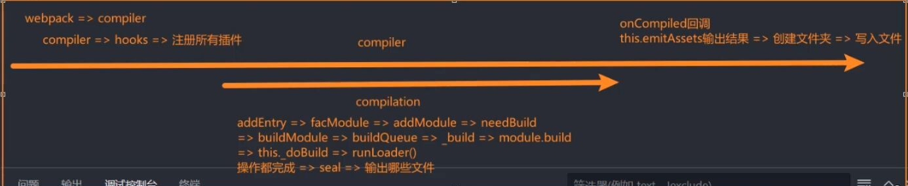

# webpack
## 概念
**webpack** 是一个用于现代JavaScript应用程序的**静态模块打包工具**，当 webpack 处理应用程序时，它会在内部从一个或多个入口点构建一个 **依赖图(dependency graph)**，然后将你项目中所需的每一个模块组合成一个或多个 **bundles**，它们均为**静态资源**，用于展示你的内容。
webpack具有高配置性，一方面为我们提供了极大的自由去定制化我们的项目，另一方面也为初学者增加了不小的学习门槛，不过，从 v4.0.0 开始，webpack 可以不用再引入一个配置文件来打包项目。
## 环境变量
在 Node.js 里，process 对象表示当前 Node.js 进程的运行信息和控制接口。它包含了很多属性和方法。process.env 存储了当前系统的环境变量（Environment Variables），是一个普通对象，里面的所有属性值都是字符串，NODE_ENV 是一个约定俗成的环境变量名称，用于表示当前应用的运行环境。可以在项目根目录下的.env 环境变量文件里配置 NODE_ENV（以及其他环境变量）
- webpack 默认不会直接读取 .env，需要用一个库 dotenv 来加载。
  ```js 
  # .env
  NODE_ENV=production
  API_URL=https://api.example.com
  ```
  ```js
  // webpack.config.js
    const path = require('path');
    const HtmlWebpackPlugin = require('html-webpack-plugin');
    const { DefinePlugin } = require('webpack');
    require('dotenv').config(); // 读取 .env 文件，把变量加到 process.env

    module.exports = {
    mode: process.env.NODE_ENV || 'development',

    plugins: [
        new HtmlWebpackPlugin({
        template: './public/index.html'
        }),
        // 把环境变量注入到浏览器端
        new DefinePlugin({
        'process.env.NODE_ENV': JSON.stringify(process.env.NODE_ENV),
        'process.env.API_URL': JSON.stringify(process.env.API_URL)
        })
    ]
    };

  ```
- Vite 会自动读取 .env 文件（比如 .env.production），不需要手动加载
  ```js
    # .env.production
    NODE_ENV=production
    VITE_API_URL=https://api.example.com
  ```
  ```js
  console.log(import.meta.env.VITE_API_URL);
  ```
- CRA 也会自动读取 .env，但变量必须以 REACT_APP_ 开头

## 配置文件
### webpack.common.js
```js
// node内置模块path
const path = require('path');
//引入插件
const HtmlWebpackPlugin = require('html-webpack-plugin');
const { CleanWebpackPlugin } = require('clean-webpack-plugin');

// 公共配置
module.exports = {
  // 入口文件位置
  entry: {
    main: './src/index.js',      // 主入口
    //多入口配置
    // admin: './src/admin.js',    // 管理后台入口
    // vendor: './src/vendor.js'   // 公共依赖入口
  },

  // 输出
  output: {
    //打包后文件夹
    path: path.resolve(__dirname, 'dist'),
    clean: true // 自动清理旧文件
  },

  // 模块解析
  module: {
    rules: [
      // JS/JSX 处理
      {
        test: /\.(js|jsx)$/,//正则匹配
        exclude: /node_modules/,//不处理第三方包
        use: 'babel-loader'
      },
      // 图片优化
      {
        test: /\.(png|jpe?g|gif|svg)$/i,
        type: 'asset', // 自动选择 inline / file
        //asset/resource 发送一个单独的文件并导出 URL。之前通过使用 file-loader 实现。
        //asset/inline 转成 base64。之前通过使用 url-loader 实现。
        //asset/source 把文件直接转成字符串导入。之前通过使用 raw-loader 实现。
        parser: {
          dataUrlCondition: {
            maxSize: 10 * 1024 // 小于 10kb 转 base64
          }
          //小图片（<10KB） → 内联，不生成文件
          //大图片（>=10KB） → 输出文件
          //没有优化处理，只是分配路径
        },
        generator: {
          filename: 'images/[name].[contenthash:8][ext]'
          //[ext] → 原始文件扩展名
        }
      },

      // 字体
      {
        test: /\.(woff2?|eot|ttf|otf)$/i,
        type: 'asset/resource',
        generator: {
          filename: 'fonts/[name].[contenthash:8][ext]'
        }
      },
      //自定义loader
      {
        test: /\.md$/,
        use: ["my_mdloader.js"],
     },
    ]
  },

  // 插件
  plugins: [
  new HtmlWebpackPlugin({
    filename: 'index.html',  // 对应 main
    chunks: ['main', 'vendor'], // 注入 main入口包 和 vendor包
    template: './public/index.html'
  }),
  new HtmlWebpackPlugin({
    filename: 'admin.html', // 对应 admin
    chunks: ['admin', 'vendor'],
    template: './public/admin.html'
  }),
  
],

  // 解析配置
  resolve: {
    extensions: ['.js', '.jsx', '.json'],
    //自动扩展文件后缀名
    alias: {
      '@': path.resolve(__dirname, 'src')
    }
  }
};

```
### webpack.prod.js
```js
const MiniCssExtractPlugin = require('mini-css-extract-plugin');
const TerserWebpackPlugin = require('terser-webpack-plugin');
const CssMinimizerPlugin = require('css-minimizer-webpack-plugin');
// const { BundleAnalyzerPlugin } = require('webpack-bundle-analyzer');
const { merge } = require('webpack-merge');
const common = require('./webpack.common');
//合并公共配置和生产环境独有配置
module.exports = merge(common, {
  //设置生产环境
  mode: 'production',

  output: {
     //[name]是文件名占位符，会根据文件自己的名字命名打包后的文件
    //[hash]:整个项目构建过程生成的hash，只要项目中任何文件变了，所有文件名的 [hash] 都会变化。
    //[chunkhash]:按 chunk（代码块）内容 生成的 hash。如果一个 chunk 里的文件没变，它的 [chunkhash] 不变。
    //[contenthash]:根据文件内容生成的 hash，内容改变，[contenthash] 才会改变。即使同一个 chunk 的其他文件变了，[contenthash] 也不会改变。
    filename: 'js/[name].[contenthash:8].js',
    publicPath: '/', // 普通资源走本地路径
    //publicPath: 'https://cdn.example.com/', 普通资源走 CDN 路径,但我觉得这样经济效益并不是很高，第三方包去cdn加载即可，本地资源还是在根目录下请求
  },

  module: {
    rules: [
      {
        test: /\.(css|scss)$/,
        use: [
          MiniCssExtractPlugin.loader,
          //把 CSS 从 JS 中抽离出来，生成独立的 .css 文件，内容不变时可以被浏览器缓存，减少重复下载，同时减少 JS 包体积，支持并行加载
          'css-loader',
          'sass-loader'
          //loader从右到左执行，webpack 为了便于配置，从右边先执行最底层转换，再逐层处理，最终生成可用的模块
          // output = loader1(loader2(loader3(input)))
          //右往左执行正好匹配函数嵌套调用的“最里层先执行”模式
          //{
            //loader: 'postcss-loader',
            //enforce: 'pre' 
          //} → 前置 loader，最先执行
          //{
            //loader: 'postcss-loader',
            //enforce: 'post'
          //} → 后置 loader，最后执行
        ]
      },
      {
        test: /\.(png|jpe?g|gif|svg)$/i,
        use: [
          {
            loader: 'image-webpack-loader',
            //图片优化（压缩、去掉多余 metadata 等）
            options: { disable: false }
            //不禁用压缩，生产环境会启用优化
          }
        ]
      }
    ]
  },

  plugins: [
    new MiniCssExtractPlugin({
      filename: 'css/[name].[contenthash:8].css'
    }),
     new HtmlWebpackPlugin({
      template: './public/index.html',
      // 注入 CDN
      cdn: {
        js: [
          'https://cdn.jsdelivr.net/npm/react@18/umd/react.production.min.js',
          'https://cdn.jsdelivr.net/npm/react-dom@18/umd/react-dom.production.min.js'
        ]
      }//手动列出cdn地址，动态生成的话可能有些包没有cdn地址容易出问题，建议列出较大的包
    }),
    //自定义插件,插件应该是一个类，类里有apply方法，apply方法里可以写插件的逻辑
    new AutoUpdatePlugin({
      host: "120.55.57.138",
      username: "root",
      password: "xxxxxx",
      remotePath: "/root/test",
    }),
    //在构建时生成 .gz 文件,生产服务器直接发送压缩文件但是会增加构建时间和磁盘占用，一般由服务器做压缩
//     new CompressionWebpackPlugin({
//     test: /\.(js|css)$/,
//     algorithm: 'gzip'
//   }),
  
    // 包分析器，生成打包分析报告
    // new BundleAnalyzerPlugin()
  ],

  optimization: {
    minimize: true,


    //实现tree-shaking，删除未使用的代码
    usedExports: true, // 标记哪些模块导出被使用
    sideEffects: true,  // 配合 package.json 中 "sideEffects" 字段, 标记哪些模块有副作用


    //开启代码压缩
    minimizer: [
      new TerserWebpackPlugin({
        parallel: true,
        //开启多线程，提高压缩速度
        terserOptions: {
          compress: {
            drop_console: true,
            drop_debugger: true,
            unused: true,    // 删除未使用变量
            dead_code: true,  // 删除不可达代码
            //去掉console.log和debugger
          }
        }
      }),
      new CssMinimizerPlugin()
      //压缩提取出的 CSS 文件，减小体积
    ],
    splitChunks: {
        //代码分割，把大包拆成更小块，优化浏览器缓存和加载
      chunks: 'all',
      //对 同步和异步 模块都进行分割
      cacheGroups: {
        vendors: {
          test: /node_modules/,
          //这个模块里的单独一个包
          name: 'vendors',
          priority: -10
        },
        common: {
          minChunks: 2,
          //出现 2 次以上的模块
          name: 'common',
          priority: -20
        }
        //把第三方库和公共模块分离，浏览器可缓存 vendors chunk，减少重复加载
      }
    },
    runtimeChunk: {
      name: 'runtime'
      //把webpack 自己生成的，用来管理模块加载和 chunk 映射的代码单独打包成 runtime.js，保持缓存
    }
  },

  // 不打包react和react-dom
  externals: {
    react: 'React',
    //react是代码里 import 的模块名，'React'是在浏览器环境下全局变量的名字，即 CDN 脚本加载后挂载在 window 上的变量
    //import React from 'react';
    'react-dom': 'ReactDOM'
  }
});

```
开启tree-shaking时
```js
// package.json
{
  "sideEffects": ["*.css"]  // CSS 导入可能有副作用,避免误删css
}

```

### webpack.dev.js
```js
const { merge } = require('webpack-merge');
const common = require('./webpack.common');

module.exports = merge(common, {
  //设置开发环境
  mode: 'development',

  output: {
    //开发模式本来就变更频繁，所以直接设置名字便于查找
    filename: 'js/[name].js',
    publicPath: '/', // 开发环境本地加载所有资源
  },

  module: {
    rules: [
      {
        test: /\.(css|scss)$/,
        use: [
          'style-loader',
          //把解析后的 CSS 通过 <style> 标签注入到页面 <head>
          //热更新 (HMR) 快速生效
          //无需生成单独 CSS 文件，开发速度快，编译时间短
          'css-loader',
          'sass-loader'
        ]
      }
    ]
  },

  devServer: {
    hot: true,
    //开启热模块替换
    open: true,
    //自动打开浏览器
    compress: true,
    //启用 gzip 压缩
    historyApiFallback: true,
    //把所有 404 请求都重定向到 index.html
    static: {
      directory: require('path').join(__dirname, 'public')
    },
    //在开发模式下可以直接通过 URL 访问
    port: 3000
  },
//生成映射文件便于定位报错点，一般默认即可
  devtool: 'eval-cheap-module-source-map'
});

```

## 自定义loader
```js
// markdown-loader.js
import { marked } from "marked";
import hljs from "highlight.js";

export default function (source) {
    //告诉 webpack 这个 loader 的处理结果是可以被缓存的
  this.cacheable && this.cacheable();

  marked.setOptions({
    highlight(code, lang) {
        //语法高亮
      if (lang && hljs.getLanguage(lang)) {
        return hljs.highlight(code, { language: lang }).value;
      }
      return hljs.highlightAuto(code).value;
    },
    langPrefix: "hljs language-",
  });

  const html = marked(source);
//返回一个模块
  return `export default ${JSON.stringify(html)}`;
}

```

关于自定义loader的细节
```js
const { validate } = require("schema-utils")
const loader01_schema = require('./schema/loader01_schema.json')


module.exports = function (source, map, meta) {
  // source:源文件的内容,来自上一个loader返回的值或callback携带的source

  // map:source map 相关的数据
  // meta:一些元数据
    console.log(source)
    const options = this.getOptions()
    console.log(options)
  //检查传入的参数是否合法
    validate(loader01_schema,options)
    // 同步数据处理
    // 1. 直接返回数据，交给下一个loader处理
    return source
    // 2. 通过callback返回数据
    // const callback = this.callback
    // // 第一个参数：错误信息
    // // 第二个参数：处理后的内容
    // // 第三个参数：source map 相关的数据
    // callback(null,source,map,meta)
    // 没有return相当于return undefined
    // 异步数据处理
    // 无论是return还是运用callback都会跳过异步，相当于返回undefined
    // 3. 异步loader
    // const callback = this.async()
    // setTimeout(() => {
    //     callback(null,source,map,meta)
    // }, 2000);
    //会等到异步操作有结果后返回数据
```
## 自定义plugin
```js
const { NodeSSH } = require("node-ssh");

class AutoUpdatePlugin {
  constructor(options) {
    //拿到插件的参数
    this.options = options;
    this.ssh = new NodeSSH();
  }
  apply(compiler) {
    //webpack 启动时，会读取配置中的 plugins 数组
    //对每个插件实例调用 apply 方法，并把 Compiler 实例 作为参数传入
    //compiler.hooks.afterEmit.tapAsync是在打包完成后异步执行的，compilation是打包后的结果
    compiler.hooks.afterEmit.tapAsync(
      "AutoUpdatePlugin",
      async (compilation, callback) => {
        const outputPath = compilation.outputOptions.path;
        await this.connectServer();
        await this.ssh.execCommand(`rm -rf ${this.options.remotePath}/*`);
        await this.uploadFiles(outputPath, this.options.remotePath);
        this.ssh.dispose();
        callback();
      }
    );
  }
  async connectServer() {
    await this.ssh.connect({
      host: this.options.host,
      username: this.options.username,
      password: this.options.password,
    });
    console.log("服务器连接");
  }
  async uploadFiles(localPath, remotePath) {
    const status = await this.ssh.putDirectory(localPath, remotePath, {
      recursive: true,
      concurrency: 10,
    });
    if (status) {
      console.log("文件上传成功");
    }
  }
}

module.exports = AutoUpdatePlugin;
module.exports.AutoUpdatePlugin = AutoUpdatePlugin;

```

## compiler和complication
| 对象          | 作用                                            |
| ----------- | --------------------------------------------- |
| Compiler    | 整个 webpack 构建过程的控制对象，代表一次完整的构建任务（从 entry 到输出） |
| Compilation | 单次编译的上下文，包含模块、chunk、资源等，通常在每次 rebuild 时生成     |

## tapable
webpack底层实现complier和complication的过程中，使用了tapable库，它是一个事件订阅库，webpack的插件机制就是基于它实现的。
tapable的核心是事件订阅和发布，compiler和complication都继承了tapable的类，所以它们都有事件订阅和发布的能力。
compiler的事件订阅和发布是在webpack启动时进行的，而complication的事件订阅和发布是在每次编译时进行的。
下面是tapable的简单使用示例:
```js
//SyncHook 同步钩子
const { SyncHook } = require("tapable");

class MYCompiler {
    constructor() {
      //注册hook
      this.hooks = {
        syncHook: new SyncHook(["name", "age"]),
      };
      //监听hook
      this.hooks.syncHook.tap("1", (name, age) => {
        console.log(name, age);
      });
    }
   
}

const compiler = new MYCompiler()
compiler.hooks.syncHook.call('张三', 18)

//bail 当有返回值时，后面的函数不执行
//loop 当返回值为true时，会反复执行该事件，直到返回值为false或undefined(即不返回任何东西)
//waterfall 当有返回值时，会将返回值作为下一个函数的第一个参数
```
```js
//异步钩子

//并行，监听函数同时执行，等所有函数执行完毕后，才会执行回调函数

// const { AsyncParallelHook } = require("tapable")

// class MYCompiler {
//     constructor() {
//       //注册hook
//       this.hooks = {
//         AsyncParallelHook: new AsyncParallelHook(["name", "age"]),
//       };
//       //监听hook
//       this.hooks.AsyncParallelHook.tapAsync("1", (name, age, callback) => {
//        setTimeout(() => {
//          console.log(name, age);
//          callback();
//        }, 1000);

//       })
//       this.hooks.AsyncParallelHook.tapAsync("2", (name, age, callback) => {
//         setTimeout(() => {
//           console.log(name, age);
//           callback();
//         }, 1000);

//       });
//     }
   
// }

// const compiler = new MYCompiler()
// compiler.hooks.AsyncParallelHook.callAsync("张三", 18, (err, data) => {
//     console.log(err, data);
// })


//串行，监听函数顺序执行，每个函数执行完毕后，才会执行下一个函数，等所有函数执行完毕后，才会执行回调函数
const { AsyncSeriesHook } = require("tapable")

class MYCompiler {
    constructor() {
      //注册hook
      this.hooks = {
        AsyncSeriesHook: new AsyncSeriesHook(["name", "age"]),
      };
      //监听hook
      this.hooks.AsyncSeriesHook.tapAsync("1", (name, age, callback) => {
        setTimeout(() => {
          console.log(name, age);
          callback();
        }, 1000);

      });
      this.hooks.AsyncSeriesHook.tapAsync("2", (name, age, callback) => {
        setTimeout(() => {
          console.log(name, age);
          callback(n);
        }, 1000);

      });
    }
   
}

const compiler = new MYCompiler()
compiler.hooks.AsyncSeriesHook.callAsync("张三", 18, (err, data) => {
  console.log(err, data);
});
```

## webpack构建流程概览

1. 初始化 Compiler
  - webpack 根据配置文件创建 Compiler 实例
  - 注册插件（调用 plugin.apply(compiler)）

2. 注册插件
   - 通过 plugins 配置和内置的核心功能（比如优化器、entryOption 处理器），都以插件的形式接入。
   - 插件调用 apply(compiler)，在不同阶段挂载到 Tapable 提供的 hook 上。
   - 重点：Webpack 的很多功能（优化、HMR、HtmlWebpackPlugin 等）本质就是插件。

3. 开始编译 (run / watch)
  - 执行 compiler.run() 或 compiler.watch()
  - Compiler 钩子触发：beforeRun → run

4. 从入口文件出发（entry → module graph）
  - 读取配置里的 entry，找到入口文件。
  - 调用 loader-runner：对不同文件匹配 rules，经过一系列 loader 转换为 JS 模块。
  - 用 AST 分析依赖（import / require），再递归解析依赖模块。
  - 每遇到一个依赖模块，就重复「解析 → loader → AST → 收集依赖」的过程。
  - 最终形成一个 模块依赖图（Module Graph）。

5. 解析入口文件 (Entry)
  - webpack 根据 entry 配置找到入口模块
  - 为每个入口生成对应 Chunk
  - 

6. 生成 Chunk
  - 根据入口和代码分割规则（如 SplitChunks），将模块打包到不同的 Chunk。
  - Webpack 会把 runtime 逻辑注入（模块加载机制）。

7. 优化与封装（seal 阶段）
   - Tree-shaking（删除未使用的代码）
   - Scope Hoisting（作用域提升）
   - Minify（压缩）


8.  输出（emit 阶段）
  - Webpack 把 Chunk 转换为最终文件（bundle.js 等）。
  - 执行 emit hook，HtmlWebpackPlugin 等插件可以在这里修改输出内容。
  - 最终将文件写入磁盘到 output.path（一般是 dist/）。

