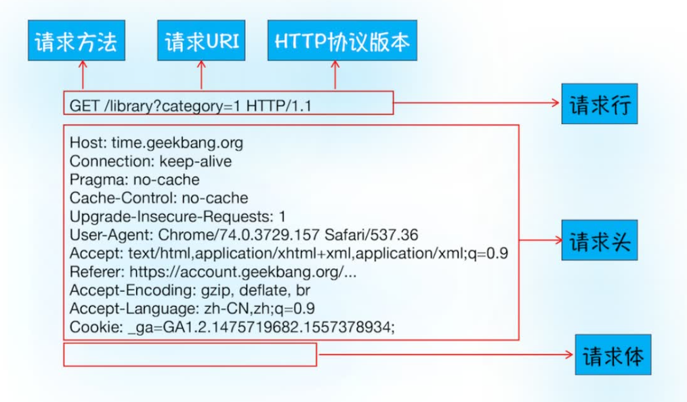
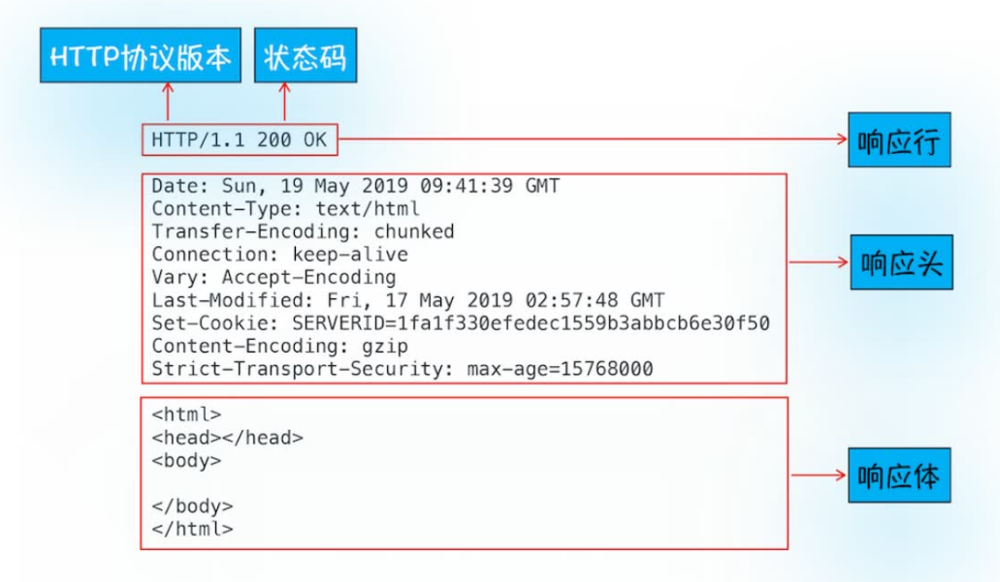
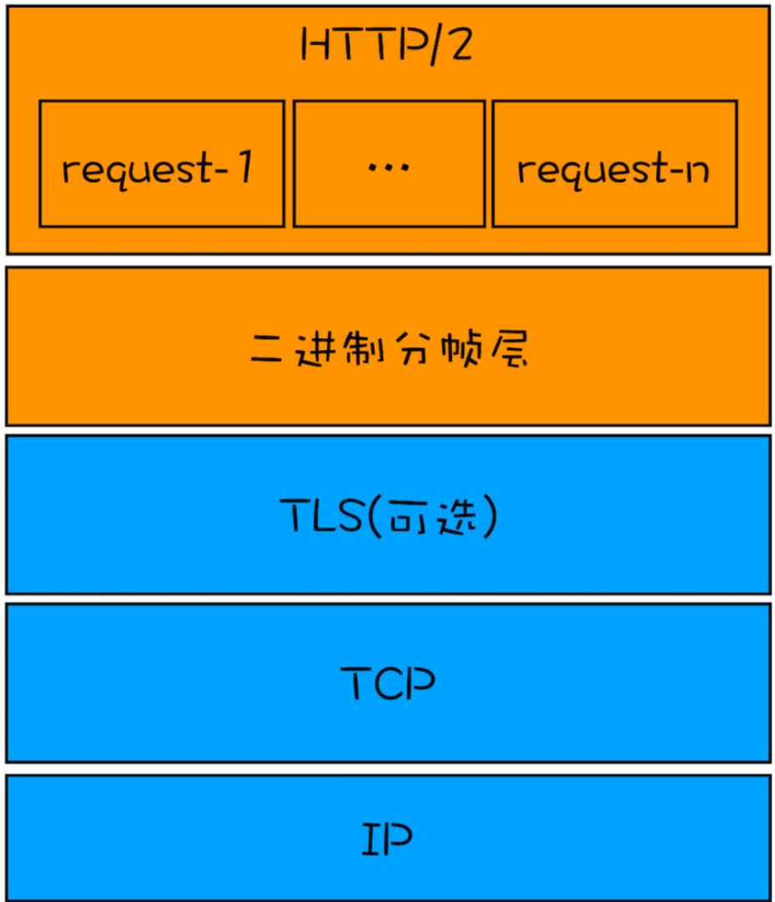
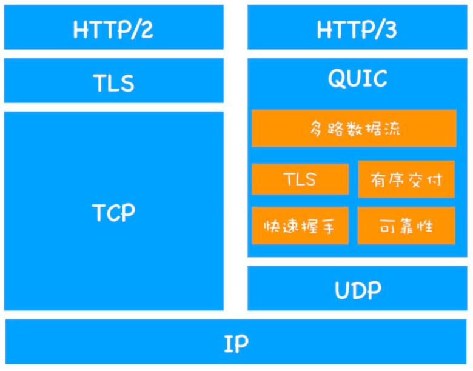

# 浏览器网络通信
## IP协议
数据包要在互联网上进行传输，就要符合网际协议（Internet Protocol，简称IP）标准。
计算机的地址就称为 IP 地址，访问任何网站实际上只是你的计算机向另外一台计算机请求
信息。
所以在计算机A向计算机B传输数据时，数据包中需要包含B的IP地址信息（以便正确寻址找到B）和A的IP地址信息（以便B回复A）。这些附加的信息会被装进一个叫 IP 头的数据结构里。IP 头是 IP 数据包开头的信息，包含 IP 版本、源 IP 地址、目标 IP 地址、生存时间等信息。
## UDP：把数据包送达应用程序
只有IP协议只能找到对方的电脑，但电脑并不知道要把数据包传给哪一个应用，因此需要更上层的协议，最常用的是：用户数据包协议（User Datagram Protocol），简称UDP。
UDP 中一个最重要的信息是端口号，IP通过 IP 地址信息把数据包发送给指定的电脑，而 UDP 通过端口号把数据包分发给正确的程序。和 IP 头一样，端口号会被装进 UDP 头里面，UDP 头再和原始数据包合并组成新的
UDP 数据包。UDP 头中除了目的端口，还有源端口号等信息。
在使用 UDP 发送数据时，有各种因素会导致数据包出错，虽然 UDP 可以校验数据是否正确，但是对于错误的数据包，UDP 并不提供重发机制，只是丢弃当前的包，而且 UDP 在发送之后也无法知道是否能达到目的地。
**所以UDP协议缺点是不能保证数据可靠性，优点是传输速度非常快。**
## TCP：把数据完整地送达应用程序
TCP（Transmission Control Protocol，传输控制协议）是一种面向连接的、可靠的、基于字节流的传输层通信协议。
TCP主要是解决了UDP的两个问题：
1. 数据包在传输过程中容易丢失。
2. 大文件会被拆分成很多小的数据包来传输，这些小的数据包会经过不同的路由，并在不同的时间到达接收端，而 UDP 协议并不知道如何组装这些数据包，从而把这些数据包还原成完整的文件。

TCP的生命周期主要包括“建立连接”，“传输数据”，“断开连接”三个阶段。
- 建立连接：
  TCP 使用“三次握手”（Three-way Handshake）来建立连接。所谓三次握手，就是在客户端和服务器之间交换三次信息，来确认双方都准备好进行数据传输。
  1. 客户端向服务器发送一个 SYN（同步）包，表示客户端希望建立连接，并告诉服务器客户端的初始序列号（ISN）。
  2. 服务器收到 SYN 包后，回复一个 SYN-ACK 包，表示同意建立连接，并告诉客户端服务器的初始序列号，同时确认收到了客户端的 SYN 包。
  3. 客户端收到 SYN-ACK 包后，回复一个 ACK 包，表示确认收到了服务器的 SYN-ACK 包。至此，连接建立完成，双方可以开始传输数据。
- 数据传输:在该阶段，接收端需要对每个数据包进行确认操作，也就是接收端在接收到数据包之后，需要发送确认数据包给发送端。所以当发送端发送了一个数据包之后，在规定时间内没有接收到接收端反馈的确认消息，则判断为数据包丢失，并触发发送端的重发机制。同样，一个大的文件在传输过程中会被拆分成很多小的数据包，这些数据包到达接收端后，接收端会按照 TCP 头中的序号为其排序，从而保证组成完整的数据。
- 断开连接:这个阶段通过“四次挥手”断开连接。
  所谓四次挥手，本质是交换 4 个 TCP 报文段（Segment），每个步骤的职责明确：
  1. 第一次挥手（客户端 → 服务器）
     客户端主动发送FIN 报文（FIN=1），表示 “我已没有数据要发送，准备关闭连接”。
     发送后，客户端进入FIN-WAIT-1 状态，等待服务器的确认。
  2. 第二次挥手（服务器 → 客户端）
     服务器收到 FIN 报文后，立即发送ACK 报文（ACK=1，确认号 = 客户端 FIN 报文的序列号 + 1），表示 “我已收到你的关闭请求，正在准备关闭”。
     发送后，服务器进入CLOSE-WAIT 状态，客户端收到 ACK 后进入FIN-WAIT-2 状态，此时客户端不再向服务器发数据，但仍能接收服务器的数据。服务器不再接受客户端的数据，但可以向客户端发数据。
  3. 第三次挥手（服务器 → 客户端）
     服务器处理完剩余数据后，确认 “已没有数据要发送”，主动发送FIN+ACK 报文（FIN=1，ACK=1），表示 “我也没有数据要发了，你可以关闭连接了”。
     发送后，服务器进入LAST-ACK 状态，等待客户端的最终确认。
  4. 第四次挥手（客户端 → 服务器）
     客户端收到服务器的 FIN+ACK 报文后，发送ACK 报文（ACK=1，确认号 = 服务器 FIN 报文的序列号 + 1），表示 “我已收到你的关闭通知，连接即将关闭”。
     发送后，客户端进入TIME-WAIT 状态（默认等待 2 个最大报文段寿命，约 1-4 分钟），确认服务器收到 ACK 后才彻底关闭；服务器收到 ACK 后，直接进入CLOSED 状态，释放连接资源。

通过上述描述我们可以看出，TCP协议的三次握手、四次挥手过程，以及中间服务器返回的确认未丢包信息都花费了大量时间，比UDP慢得多。
## HTTP请求流程
HTTP 协议是建立在 TCP 连接基础之上的。
HTTP 是一种允许浏览器向服务器获取资源的协议，是 Web 的基础，通常由浏览器发起请求，用来获取不同类型的文件HTTP 是一种允许浏览器向服务器获取资源的协议，是 Web 的基础，通常由浏览器发起请求，用来获取不同类型的文件。
流程如下：
1. 构建请求
   浏览器构建请求行信息,备发起网络请求。
   ```
   GET /index.html HTTP1.1
   ```
2. 查找缓存
   浏览器缓存是一种在本地保存资源副本，以供下次请求时直接使用的技术,在发起网络请求之前，浏览器会先查看本地是否有缓存。
   - 若发现有缓存，则会拦截请求，返回该本地资源的副本并直接结束请求。
   - 若缓存过期了，浏览器会继续发起网络请求，并在HTTP请求头中带上：
        ```
        If-None-Match:"4f80f-13c-3a1xb12a"
        ```
        服务器收到请求头后，会根据这个值来判断这个资源是否有更新，如果没有更新，就返回特殊状态码，相当于告知浏览器：这个缓存可以继续使用，这次就不重复发送数据给你了。如果有更新，服务器就返回新资源。
       （这个缓存机制可以缓解服务器压力，提升性能，实现快速加载资源）
   - 若无缓存，则进入下一阶段。
3. 准备IP地址和端口
   浏览器使用HTTP 协议作为应用层协议，用来封装请求的文本信息，使用TCP/IP 作为传输层协议：
   因 OSI 七层过于复杂，实际网络中多采用 TCP/IP 四层模型，本质是对 OSI 的简化合并：
   **网络接口层**：合并 OSI 的物理层 + 数据链路层，负责物理传输和局域网帧封装。
   **网络层
   **：与 OSI 网络层功能完全一致，核心是 IP 协议和路由转发。
   **传输层**：与 OSI 传输层一致，包含 TCP、UDP 协议（便于查找应用）。
   **应用层**：合并 OSI 的会话层 + 表示层 + 应用层，直接对应各类应用协议（定义应用间数据交互的规则）。

    浏览器首先应该根据IP地址寻找服务器，但是IP地址是纯数字，难以记忆，所以我们多会使用域名，浏览器会请求DNS（域名映射为 IP 的系统就叫做“域名系统”，简称DNS（Domain Name System）。返回域名对应的IP，同时，浏览器还提供了DNS 数据缓存服务，如果某个域名已经解析过，浏览器就直接使用缓存。拿到IP后，浏览器就会获取端口，不写则默认端口号为80。
4. 等待TCP队列及建立连接
   chorme有同一域名同时最多只能建立6个TCP连接，如果多余6个会进入等待状态。这个等待结束后，就可以与服务器建立连接了
5. 发送HTTP请求
   建立TCP连接后，浏览器就可以与服务器通信了。
   1. 首先，浏览器会向服务器发送请求行（包括请求方法、请求URL、HTTP版本协议）
   2. 再以请求头的形式发送其他浏览器基础信息，以及之前保存过的Cookie信息。
        
        若请求方法为post则会带有请求体。
   3. 服务器会根据浏览器请求来准备相应内容。 
        如果触发了重定向操作，响应行返回的状态码特殊的，告诉浏览器需要重定向，网址包含在响应头的location字段中，浏览器就会根据这个网址再走一遍上述流程。
   4. 先返回响应行，包括协议版本和状态码。
   5. 再返回响应头，告诉浏览器返回内容的类型、长度、服务器自身的一些信 息、以及服务器要在客户端保存的 Cookie 等信息。
   比如：
   ```
   Set-Cookie: UID=3431uad;
   ```
   浏览器会把这个字段信息保存到本地。
   浏览器还可以通过响应头Cache-Control 字段来设置是否缓存该资源。其中 Max-age 参数可以设置缓存过期时长。
   6. 最后返回响应体，即请求的资源内容。
        
6. 断开连接
    一旦服务器向客户端返回了请求数据，它就要关闭 TCP 连接。但是如果我们可能会对某个域名频繁请求文件，而反复断开重连就过于浪费性能和事件了，所以我们可以在请求头中加入
    ```
    Connection:Keep-Alive
    ```
    这样服务器就不会断开连接，提升资源加载速度。

## 网络通信时浏览器的行为
1. 浏览器主进程接收到用户，判断是搜索文字还是URL
   - 如果是搜索内容，地址栏会使用浏览器默认的搜索引擎，来合成新的带搜索关键字的URL。
   - 如果判断输入内容符合 URL 规则，那么地址栏会根据规则，把这段内容加上协议，合成为完整的 URL。
2. 浏览器主进程会通过进程间通信（IPC）把URL发送给网络进程，再由网络进程发起URL。
3. 首先，网络进程会查找本地是否缓存了该资源，如果有缓存资源，那么直接返回资源给浏览器进程；如果在缓存中没有查找到资源，那么直接进入网络请求进程。
4. 首先进行DNS解析，获取IP地址，如果协议是HTTPS，还需要建立TLS连接。TLS（Transport Layer Security，传输层安全协议）是建立在 TCP 之上的加密通信协议，用于在客户端和服务器之间构建安全的 “加密通道”，防止数据在传输过程中被窃听、篡改或伪造（核心解决 “机密性、完整性、身份认证” 问题）。[详情](./3_浏览器安全.md)。
5. 返回的响应头其Content-Type的值
   - 如果是application/octet-stream，表明返回的数据是字节流类型的，通常情况下浏览器会按照下载类型来处理。
   - 如果是 text/html就是返回的数据是HTML格式。
6. 如果是HTML格式的，接下来就会准备渲染引擎，默认情况下，Chrome 会为每个页面分配一个渲染进程，也就是说，每打开一个新页面就会配套创建一个新的渲染进程。但如果从一个页面打开了另一个新页面，而新页面和当前页面属于同一站点（根域名加上协议还包含了该根域名下的所有子域名和不同的端口都相同）的话，那么新页面会复用父页面的渲染进程。这个是process-per-site-instance策略。
7. “提交文档”的消息是由浏览器主进程发出的，渲染进程接收到“提交文档”的消息后，会和网络进程建立传输数据的“管道”。等文档数据传输完成之后，渲染进程返回“确认提交”的消息给浏览器主进程。浏览器主进程接收到“确认提交”的消息后，更新浏览器的界面状态。
8. 一旦文档被提交，渲染进程便开始页面解析和子资源加载了。

## HTTP发展史
### HTTP/1
#### 超文本传输协议HTTP/0.9
HTTP/0.9 是于 1991 年提出的，主要用于学术交流，需求很简单——用来在网络之间传递 HTML 超文本的内容，所以被称为**超文本传输协议**。
请求流程如下：
1. 构建请求并通过DNS查询IP地址
2. 建立TCP连接，TCP协议三次握手
3. 建立好连接后发送GET请求行信息，如GET /index.html用来获取index.html。
4. 服务器接收请求信息之后，读取对应的 HTML 文件，并将数据以 ASCII 字符流返回给客户端。
5. HTML 文档传输完成后，四次挥手断开连接。
#### HTTP/1.0
随着互联网的高速发展，浏览器需要传输的文件内容变复杂了，需要在交流时带上文件编码、文件类型等信息，所以HTTP/1.0 引入了请求头和响应头，它们都是以为 Key-Value 形式保存的，在发起请求时候会通过 HTTP 请求头告诉服务器它期待服务器返回什么类型的文件、采取什么形式的压缩、提供什么语言的文件以及文件的具体编码。最终浏览器需要根据响应头的信息来处理数据。状态码，Cache机制，用户代理都是通过响应头和请求头实现的。
#### HTTP/1.1
1. 改进持久连接
   随着浏览器普及，单个页面中的图片文件越来越多，有时候一个页面可能包含了几百个外部引用的资源文件，如果在下载每个文件的时候，都需要经历建立 TCP 连接、传输数据和断开连接这样的步骤，无疑会增加大量无谓的开销。所以在HTTP/1.1中增加了持久连接的办法：在一个 TCP 连接上可以传输多个 HTTP 请求，只要浏览器或者服务器没有明确断开连接，那么该 TCP 连接会一直保持。
   不过持久连接需要等待前面的请求返回之后，才能进行下一次请求。如果 TCP 通道中的某个请求因为某些原因没有及时返回，那么就会阻塞后面的所有请求，这就是著名的**队头阻塞**的问题。**管线化**是整批提供多个HTTP请求给服务器，服务器仍按顺序回复，所以并未解决问题，后面被放弃了。
2. 提供虚拟主机的支持
   浏览器只能同时支持6个TCP连接，但HTTP/1.0实现在一台物理主机上绑定多个虚拟主机，每个虚拟主机都有自己的单独的域名，这些单独的域名都公用同一个 IP 地址。HTTP/1.1 的请求头中增加了Host 字段，用来表示当前的域名地址，这样服务器就可以根据不同的 Host 值做不同的处理。
3. 对动态生成的内容提供了完美支持
   很多页面的内容都是动态生成的，因此在传输数据之前并不知道最终的数据大小，这就导致了浏览器不知道何时会接收完所有的文件数据。HTTP/1.1 通过引入Chunk transfer 机制来解决这个问题，服务器会将数据分割成若干个任意大小的数据块，每个数据块发送时会附上上个数据块的长度，最后使用一个零长度的块作为发送数据完成的标志。这样就提供了对动态内容的支持。
4. 新增客户端Cookie、安全机制
### HTTP/2
#### HTTP/1的缺点
对于HTTP/1来说
- 页面中常用的一些关键资源文件本来就不大，但由于TCP的慢启动，耗费时间会变长，推迟首屏渲染速度。
- 同时开启多条TCP连接，这些连接会竞争固定的带宽，当带宽不足时，各个TCP连接就会动态减慢接收数据的速度，而有的TCP之间无法协商哪些是关键资源，会影响其下载速度。
- 最后，前面提到的队头阻塞问题使得数据不能并行请求，不利于浏览器优化。
#### HTTP/2的改进
所以HTTP/2的思路就是一个域名只用一个TCP保持长连接，这样整个页面的慢启动只有一次，也没有竞争带宽的问题
对于队头阻塞问题，HTTP/2实现资源的并行请求，就是任何时候都可以发送请求到服务器，服务器也可以随时返回资源。这是HTTP/2最核心的**多路复用机制**，服务器可自行决定先返回哪些资源，因为每份数据都有对应的id，浏览器接收后可以自行拼接。另外，当收到优先级较高的请求时，服务器可以暂停之前的请求来优先处理关键资源的请求。
#### 多路复用机制的实现
请看下图：

明显的，HTTP/2在HTTP/1的基础上增加了数据分帧层，数据经过其处理后，会被转换为一个个带有请求 ID 编号的帧，通过协议栈将这些帧发送给服务器。服务接收到所有帧之后，会将所有相同 ID 的帧合并为一条完整的请求信息。服务器给浏览器返回数据也是同样流程。
#### 其他特性
1. 因为引入了二进制分帧层，所以可以在数据包里写上请求优先级
2. HTTP/2还可以直接将数据推送到浏览器，当用户请求一个 HTML 页面之后，
   服务器知道该 HTML 页面会引用几个重要的JavaScript 文件和 CSS 文件，那么在接收到 HTML 请求之后，附带将要使用的 CSS 文件和 JavaScript 文件一并发送给浏览器，这样也可以保证重要的数据先请求。
3. 头部压缩，浏览器发送请求时，基本都是发送的请求头，很少有请求体，所以 头部压缩也可以较为明显地提升传输效率。

### HTTP/3
#### HTTP/2的缺陷
- 对于前面提到的队头阻塞问题，虽然HTTP/2的多路复用机制解决了队头堵塞影响重要资源返回速度的问题，但其实队头阻塞这个问题来源于TCP最初就是为了但连接而设计的，所以在传输文件时是按照顺序传输的，这就导致了在传输过程中有一个数据因为网络故障或者其他原因而丢包了，那么所有剩余包都会处于暂停状态，等待丢失的包被重新传输过来。在 TCP 传输过程中，由于单个数据包的丢失而造成的阻塞称为 TCP 上的队头阻塞。
- TCP建立连接的延时
  网络延迟又称为 RTT（Round Trip Time），把从浏览器发送一个数据包到服务器，再从服务器返回数据包到浏览器的整个往返时间称为 RTT，这是反应网络性能的一个重要指标。
  1. 在建立 TCP 连接的时候，需要和服务器进行三次握手来确认连接成功，也就是说需要在消耗完 1.5 个 RTT 之后才能进行数据传输。
  2. 进行 TLS 连接，TLS 有两个版本——TLS1.2 和 TLS1.3，每个版本建立连接所花的时间不同，大致是需要 1～2 个 RTT，[详见](./3_浏览器安全.md)
   总之，在传输数据之前，我们需要花掉 3～4 个 RTT。会影响用户体验。
- TCP协议的僵化
  网络通信时中间有非常多的设备，这些设备使用了大量的TCP特性，设置后就很少更新了。除此之外，操作系统也是导致 TCP 协议僵化的另外一个原因，因为 TCP 协议都是通过操作系统内核来实现的，应用程序只能使用不能修改。通常操作系统的更新都滞后于软件的更新。
- 由于TCP僵化，想要修改TCP协议非常困难，因为中间设备的僵化，这些设备只 认 TCP 和 UDP，如果采用了新协议，新协议在这些设备同样不被很好地支持。
#### HTTP/3的答案
选择了一个折衷的方法——UDP 协议，基于 UDP 实现了类似于 TCP 的多路数据流、传输可靠性等功能，我们把这套功能称为QUIC 协议。
http2和http3的区别如下：

1. 实现了类似TCP的流量控制、传输可靠性的功能，QUIC 在 UDP 的基础之上增加了一层来保证数据可靠性传输。它提供了数据包重传、拥塞控制以及其他一些 TCP 中存在的特性。
2. QUIC 使用的是 TLS1.3，少了握手所花费的 RTT 个数。
3. 实现了 HTTP/2 中的多路复用功能，和 TCP 不同，QUIC 实现了在同一物理连接上可以有多个独立的逻辑数据流，实现了数据流的单独传输。
4. QUIC 协议是在用户态实现的，应用程序可以直接对其进行修改和升级，而不需要等待操作系统内核的更新。
5. 实现了快速握手功能。由于 QUIC 是基于 UDP 的，所以 QUIC 可以实现使用 0-RTT 或者 1-RTT 来建立连接。
#### HTTP/3的不足
1. 服务器和浏览器端都没有对 HTTP/3 提供比较完整的支持。
2. 系统内核对 UDP 的优化远远没有达到TCP 的优化程度，所以部署HTTP/3也有一定阻碍。
3. 中间设备僵化的问题。这些设备对 UDP 的优化程度远远低于 TCP，
据统计使用QUIC 协议时，大约有 3%～7% 的丢包率。

