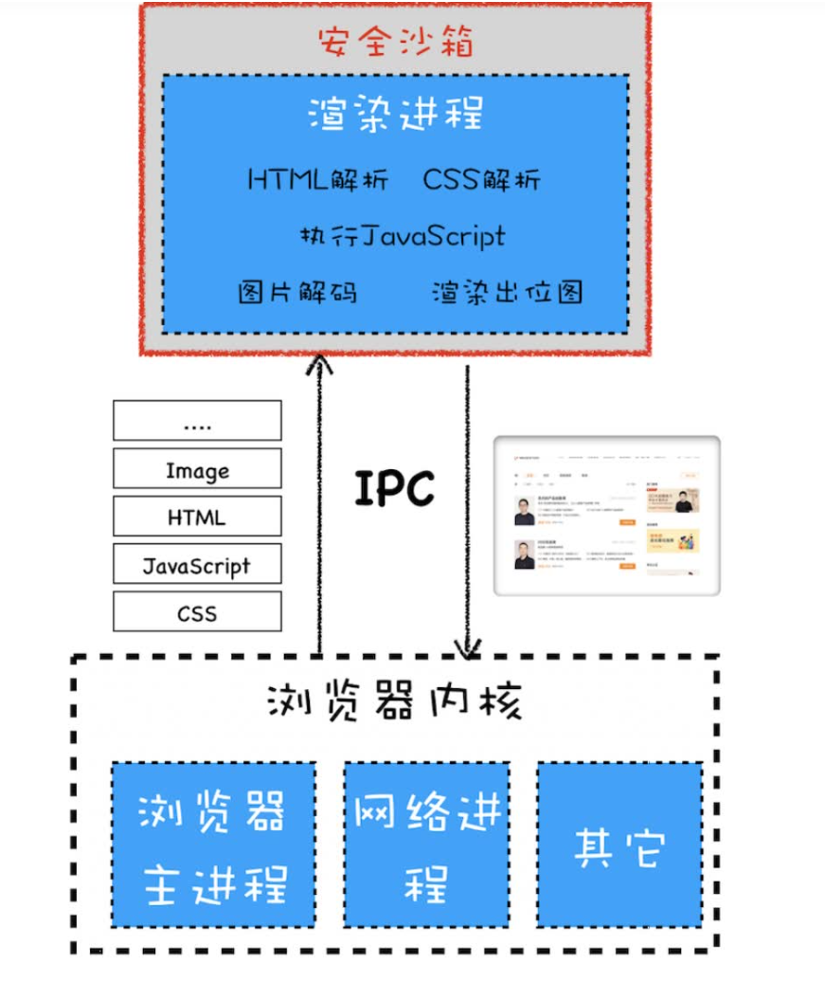
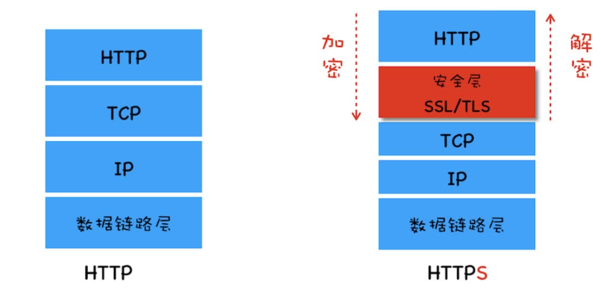
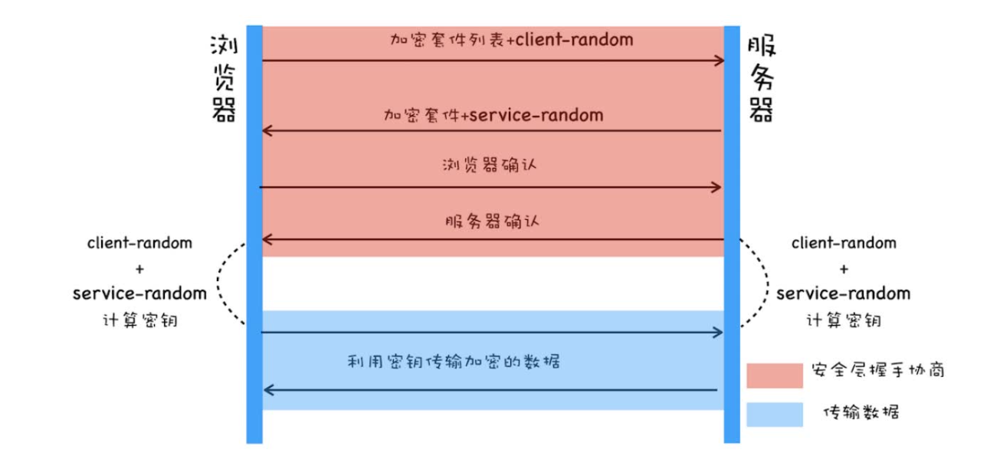
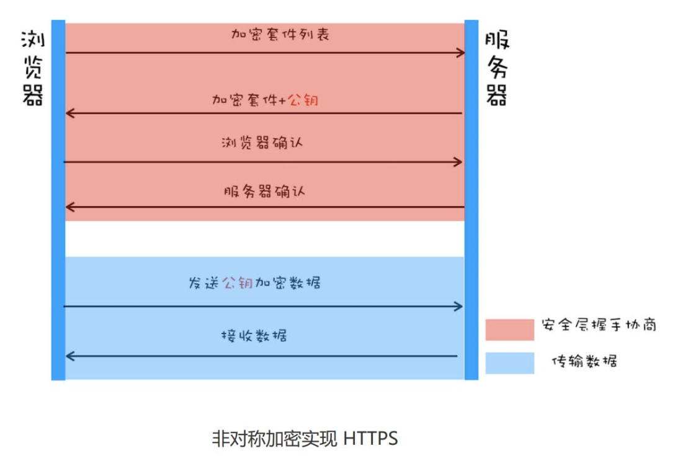
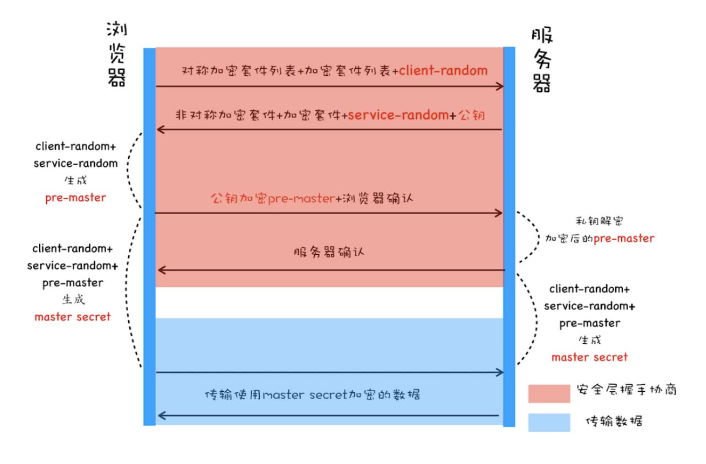
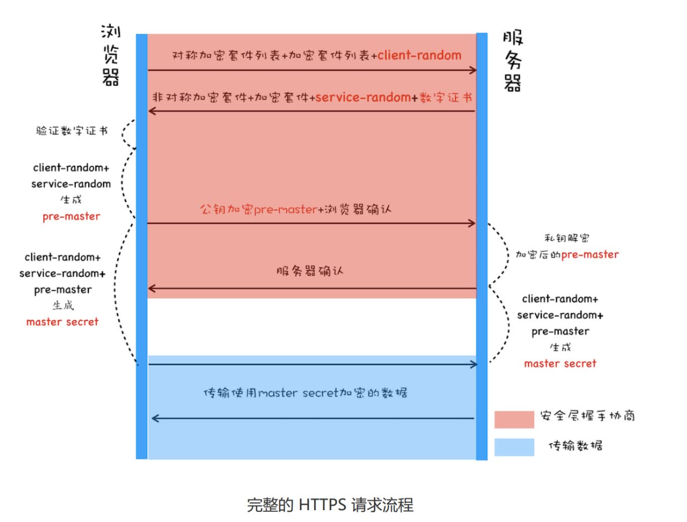

# 浏览器安全
在没有安全保障的 Web 世界中，我们是没有隐私的，因此需要安全策略来保障我们的隐私和数据的安全。
**同源策略**是页面中最基础、最核心的安全策略。
如果两个 URL 的协议、域名和端口都相同，我们就称这两个 URL 同源。浏览器默认两个相同的源之间是可以相互访问资源和操作 DOM 的。两个不同的源之间若想要相互访问资源（页面中的cookie、indexDb、localStorage等）或者操作 DOM或者发送数据（通过 XMLHttpRequest 等方式将站点的数据发送给不同源的站点），那么会有一套基础的安全策略的制约，我们把这称为同源策略。
## 浏览器让出的同源策略
但是，web的世界是开放的，如果限制所有资源都来源于同一源，无疑违背了互联网的初衷。
所以，浏览器放开了以下权限：
- 页面可以嵌入第三方资源
- 跨域资源共享（CORS），使用该机制可以进行跨域访问控制，从而使跨域数据传输得以安全进行。
  本质是浏览器和服务器通过 HTTP 请求头与响应头的 “对话”，判断请求是否安全、能否通过。服务器通过设置响应头，告知浏览器 “允许哪些跨域请求。主要请求分为两类：
  1. 简单请求：请求方法为：GET、POST、HEAD。并且请求头仅包含：Accept、Accept-Language、Content-Language、Content-Type（且值为 text/plain、multipart/form-data、application/x-www-form-urlencoded）。
  2. 预检请求（Preflight）：不满足简单请求条件（如 PUT/DELETE 方法、自定义请求头），浏览器会先发送一个OPTIONS 方法的 “预检请求”，确认服务器允许后，再发送真实请求。
   除此之外，还有几种解决跨域问题的办法：
  - JSONP：通过动态创建 `<script>` 标签来实现跨域请求数据，只支持 GET 请求。
  - 服务器代理：通过同源的服务器作为中间人，转发请求到不同源的服务器，从而实现跨域请求。

- 跨文档消息机制，可以通过 window.postMessage 的 JavaScript 接口来和不同源的 DOM 进行通信。
  核心方法:
  1. 发送方通过调用目标窗口的postMessage()方法，将数据传递给对方。
   ```js
   targetWindow.postMessage(message, targetOrigin, [transfer]);
   ```
   - targetWindow：必须，目标窗口的引用。可以是iframe的contentWindow（父页面给 iframe 发消息）、window.open()返回的窗口对象（原窗口给新窗口发消息）等。
   - message：必须，要传递的数据。可以是字符串、数字、对象等（会被自动序列化，接收时需处理）。
   - targetOrigin：必须，指定目标窗口的源（格式为协议+域名+端口，如https://www.test.com）。设为*表示允许所有源接收（不推荐，存在安全风险），设为具体源可避免数据被无关窗口接收。
   - transfer：可选，用于传递可转移对象（如ArrayBuffer），转移后发送方将失去对该对象的所有权，通常很少用。
   例：
   ```js
   // 1. 获取iframe的window引用
     const iframe = document.getElementById('myIframe');
     const targetWindow = iframe.contentWindow;

     // 2. 发送消息（目标源为iframe的实际源，如https://iframe.test.com）
     targetWindow.postMessage({ type: 'login', user: '张三' }, 'https://iframe.test.com');
   ```
   2. 接收方通过监听自身window的message事件，捕获发送方传递的数据，并进行处理。
   ```js
      window.addEventListener('message', (event) => {
     // 1. 验证发送方源（关键！避免接收恶意消息）
     if (event.origin !== 'https://trusted-origin.com') {
       return; // 不是可信源，直接忽略
     }

     // 2. 处理接收到的消息
     console.log('接收到的数据：', event.data);

     // 3. （可选）向发送方回传消息
     event.source.postMessage({ type: 'reply', status: 'success' }, event.origin);
   });
   ```
## XSS攻击
XSS 全称是 Cross Site Scripting，为了与“CSS”
区分开来，故简称 XSS，翻译过来就是“跨站脚本”，XSS 攻击是指黑客往 HTML 文件中或者 DOM 中注入恶意脚本，从而在用户浏览页面时利用注入的恶意脚本对用户实施攻击的一种手段。最开始的时候，这种攻击是通过跨域来实现的，所以叫“跨域脚本”。但是发展到现在，往HTML 文件中注入恶意代码的方式越来越多了，所以是否跨域注入脚本已经不是唯一的注入手段了，但是 XSS 这个名字却一直保留至今。
由于浏览器无法区分脚本是被恶意注入的还是正常的，所以恶意脚本也拥有相同的权限。
### 恶意脚本可以：
- 窃取Cookie：通过“document.cookie”取 Cookie信息，然后通过 XMLHttpRequest 或者 Fetch 加上 CORS 功能将数据发送给恶意服务器；
- 监听用户行为：恶意 JavaScript 可以使用
“addEventListener”接口来监听键盘事件，比如可以获取用户输入的信用卡等信息，将其发送到恶意服务器。
- 修改 DOM伪造假的登录窗口，骗取用户密码。
- 生成浮窗广告等
### 恶意脚本注入方式：
1. 存储型XSS攻击
   大致步骤为：黑客将恶意JS代码提交到有漏洞的网站数据库中，用户请求带有恶意的JS脚本，恶意脚本在用户浏览时窃取数据。
2. 反射性XSS
   在一个反射型 XSS 攻击过程中，恶意 JavaScript 脚本属于用户发送给网站请求中的一部分，随后网站又把恶意 JavaScript 脚本返回给用户。当恶意 JavaScript 脚本在用户页面中被执行时，黑客就可以利用该脚本做一些恶意操作。大概操作方式是黑客引导用户点击恶意链接，此时用户就将恶意脚本提交给了服务器，服务器再返回带有恶意的页面，这种攻击与前面的攻击主要差异在于这种不会有记忆性。
3. 基于DOM的XSS攻击
    这种攻击方式与前两种不同，它完全发生在客户端。在 Web 资源传输过程或者在用户使用页面的过程中修改 Web 页面的数据。
### 如何阻止
无论是何种类型的 XSS 攻击，都是首先往浏览器中注入恶意脚本，然后再通过恶意脚本将用户信息发送至黑客部署的恶意服务器上。所以要阻止 XSS 攻击，我们可以通过阻止恶意 JavaScript 脚本的注入和恶意消息的发送来实现。
1. 服务器对输入脚本进行过滤或转码：
   比如这段代码：
   ```js
   code:<script>alert('你被xss攻击了')</script>
   ```
   过滤后的结果是：
   ```js
   code:
   ```
   转码后的结果是：
   ```js
   code:&lt;script&gt;alert(&#39;你被xss攻击了&#39;)&lt;/script&gt;
   ```
   这样页面就不会执行这段脚本了。
2. 内容安全策略CSP
   CSP 的核心思想是让服务器决定浏览器能够加载哪些资源，让服务器决定浏览器是否能够执行内联 JavaScript 代码。
   所以，我们可以：
   1. 限制其他域下的资源文件，这样即使在我们的网站下插入了JS文件，也是无法被执行的。
   2. 禁止向第三方域提交信息，这样就避免了用户信息外泄。
   3. 禁止内联脚本和未授权的脚本。
3. HttpOnly属性：
   由于很多 XSS 攻击都是来盗用 Cookie 的，因此还可以通过使用 HttpOnly 属性来保护我们 Cookie 的安全。
   ```js
   set-cookie: NID=189=M8q2FtWbsR8RlcldPVt7qkrqR38LmFY9jUxkKo3-4Bi6Qu_ocNOat7nkYZUTzolHjFnw
   ```
   set-cookie 属性值最后使用了 HttpOnly 来标记该 Cookie。顾名思义，使用 HttpOnly 标记的 Cookie 只能使用在 HTTP 请求过程中，所以无法通过 JavaScript 来读取这段 Cookie。
## CSRF攻击
CSRF 英文全称是 Cross-site request forgery，
所以又称为“跨站请求伪造”，是指黑客引诱用户打开黑客的网站，在黑客的网站中，利用用户的登录状态发起的跨站请求。简单来讲，CSRF 攻击就是黑客利用了用户的登录状态，并通过第三方的站点来做一些坏事。当用户打开黑客的网站后：
1. 自动发起Get请求
   ```js
   <imgsrc="https://localhost:8080?user=hacker&number=100">
   ```
   像这种，页面加载图片时就会自动发送GET请求，如果服务器没有做判断的话，用户的钱就被转走了。
2. 自动发送POST请求
   由于有一些服务器是使用POST方法的，所以有时候也会伪造这种：
   ```js
   <form action="https://localhost:3000" method="POST">
   <input type="hidden" name="csrf-token"value="userToken">
   <input type="text" name="user">
   <input type="text" name="number">
   <input type="submit">
   </form>
   ```
## CSRF与XSS的区别
XSS 是往浏览器中注入恶意脚本而盗取用户信息，而 CSRF 是利用用户的登录状态发起跨站请求。一般情况下就是在社交平台等传播自己的链接，等待用户在特定平台的登录状态下点击，利用用户的信息去做一些坏事。
## 浏览器架构与操作系统安全
浏览器本身的漏洞是单进程浏览器的一个主要问题，在这
些漏洞没有被及时修复的情况下，黑客就有可能通过恶意的页面向浏览器中注入恶意程序，这样的攻击是可以入侵到浏览器进程内部的，可以读取和修改浏览器
进程内部的任意内容，甚至可以在用户操作系统上悄悄地安装恶意软件、监听用户键盘输入信息以及读取用户硬盘上的文件内容。
现代浏览器的设计目标是安全、快速、稳定。所以现代浏览器采用的多进程架构在着手解决这个问题。

现代浏览器被划分为浏览器内核和渲染内核两个部分，浏览器内核是由网络进程、浏览器主进程、GPU进程组成的，渲染内核就是渲染进程。
所有的网络资源都是通过浏览器内核来下载的，下载后的资源会通过 IPC 将其提交给渲染进程（浏览器内核和渲染进程之间都是通过 IPC 来通信的）。然后渲染进程会对这些资源进行解析、绘制等操作，最终生成一幅图片。但是渲染进程并不负责将图片显示到界面上，而是将最终生成的图片提交给浏览器内核模块，由浏览器内核模块负责显示这张图片。
如果下载了恶意程序，没有执行的情况下是不会生效的，所以我们可以由浏览器内核自由地下载所有资源，由被安全沙箱隔开的渲染进程去执行，这样就算浏览器有漏洞也不会影响到操作系统。
### 浏览器中的安全沙箱
浏览器中的安全沙箱是利用操作系统提供的安全技术，让渲染进程（安全沙箱的最小保护单位是进程，所以单进程浏览器无法被保护）在执行过程中无法访问或者修改操作系统中的数据，在渲染进程需要访问系统资源的时候，需要通过浏览器内核来实现，然后将访问的结果通过 IPC 转发给渲染进程。
有了安全沙箱，渲染进程就被隔离开只负责绘制图片了，无论是持久储存的Cookie和文件、网络访问还是用户交互（向用户展示页面和处理用户输入都是由浏览器内核处理），都需要通过IPC协议让浏览器内核访问。
### 站点隔离
Chrome 将同一站点（包含了相同根域名和相同协议的地址）中相互关联的页面放到同一个渲染进程中执行。
最开始 Chrome 划分渲染进程是以标签页为单位，
也就是说整个标签页会被划分给某个渲
染进程。但是，按照标签页划分渲染进程存在一些问题，
原因就是一个标签页中可能包含了多个 iframe，而这些 iframe 又有可能来自于不同的站点，这就导致了多个不同站点中的内容通过 iframe 同时运行在同一个渲染进程中。
因此 Chrome 几年前就开始重构代码，将标签级的渲染进程重构为 iframe 级的渲染进程，然后严格按照同一站点的策略来分配渲染进程，这就是 Chrome 中的站点隔离。
实现了站点隔离，就可以将恶意的 iframe 隔离在恶意进程内部，使得它无法继续访问其他iframe 进程的内容，因此也就无法攻击其他站点了。
### 安全沙箱对XSS和CSRF的防护作用
1. 对XSS有部分防护作用：安全沙箱的核心逻辑是限制代码的执行权限（如禁止访问敏感 API、限制 DOM 操作范围等）。例如，在浏览器中，若将不受信任的内容（如用户输入的 HTML/JS）放入隔离的沙箱环境（如通过 iframe sandbox 属性），可以禁止脚本执行、阻止跨域访问，从而直接阻断部分 XSS 攻击的利用（如防止注入的脚本窃取父页面 Cookie 或操作 DOM）。
   若沙箱配置不当（如 sandbox 属性遗漏关键限制，或沙箱内存在漏洞），攻击者仍可能突破限制。例如，沙箱允许 allow-scripts 但未限制其他权限，注入的脚本仍可执行并发起部分攻击；此外，针对沙箱外的 XSS（如主页面自身的输入处理漏洞），沙箱无法防护。
2. 对CSRF几乎无直接防护作用：CSRF 攻击的核心是利用用户的身份凭证（如 Cookie）在用户不知情的情况下发起跨站请求，其本质是 “滥用用户的已认证状态”，而非执行恶意代码。安全沙箱主要限制代码执行权限，无法阻止跨站请求的发起（例如，沙箱内的表单提交或 img 标签的 src 请求仍可能触发 CSRF，因为浏览器会自动携带 Cookie）。
## HTTPS安全
我们使用 HTTP 传输的内容很容易被中间人窃取、伪造和篡改，通常我们把这种攻击方式称为中间人攻击。
在数据在浏览器和服务器中间的每个环节中，数据都有可能被窃取或篡改。比如用户电脑被黑客安装了恶意软件，那么恶意软件就能抓取和篡改所发出的 HTTP 请求的内容。或者用户一不小心连接上了 WiFi 钓鱼路由器，那么数据也都能被黑客抓取或篡改。
由此，我们需要在 TCP 和 HTTP 之间插入一个安全层，所有经过安全层的数据都会被加密或者解密。

加密方式的进化流程如下：
1. 对称加密：加密和解密使用同一把密钥，速度快，但密钥分发困难，容易被窃取。
   
   1. 浏览器发送它所支持的加密套件列表（浏览器能支持多少种加密方法列表。）和一个随机数 client-random。
   2. 服务器会从加密套件列表中选取一个加密套件，然后还会生成一个随机数 service-random，并将 service-random 和加密套件列表返回给浏览器。
   3. 最后浏览器和服务器分别返回确认消息。
   4. 然后它们再使用相同的方法将 client-random 和 service-random 混合起来生成一个密钥 mastersecret，有了密钥 master secret 和加密套件之后，双方就可以进行数据的加密传输了。
   这个加密方式传输 client-random 和 service-random 的过程是明文的，黑客也可以拿到协商的加密套件和双方的随机数，由于利用随机数合成密钥的算法是公开的，所以黑客拿到随机数之后，可以合成密钥，这样数据依然可以被破解。
2. 使用非对称加密：非对称加密算法有 A、B 两把密钥，如果你用 A 密钥来加密，那么只能使用 B 密钥来解密；反过来，如果你要 B 密钥来加密，那么只能用 A 密钥来解密。
   
   服务器会将加密套件和公钥一道发送给浏览器。这样即便黑客截获了数据和公钥，由于不知道私钥，他无法解密。这样就能保证浏览器发送给服务器的数据是安全的了。
   但是这样有两个问题：
   1. 非对称加密算法的速度比较慢，影响性能。
   2. 无法保证服务器发送给浏览器的数据安全。
      1. 黑客可以伪造服务器，把自己的公钥发送给浏览器，这样浏览器就会使用黑客的公钥加密数据，黑客就能解密数据了。
      2. 服务器端只能采用私钥来加密，黑客也是可以获取得到公钥的，这样就不能保证服务器端数据的安全了。
3. 对称加密和非对称加密搭配使用
   在传输数据阶段依然使用对称加密，但是对称加密的密钥我们采用非对称加密来传输。
   
   1. 浏览器向服务器发送对称加密套件列表、非对称加密套件列表和随机数 client-random。
   2. 服务器选择对称加密和非对称加密的套件，保存随机数 client-random，生成随机service-random，并将选择的加密套件、service-random 和公钥返回给浏览器。
   3. 浏览器保存公钥，并利用 client-random 和 service-random 计算出来 pre-master，然后利用公钥对 pre-master 加密，并向服务器发送加密后的数据；
   4. 服务器拿出自己的私钥，解密出 pre-master 数据，并返回确认消息。
   5. 有了对称加密的密钥之后，双方就可以使用对称加密的方式来传输数据了。
4. 以上方案看似已经很完美了，但黑客伪造服务器的问题仍未解决。
   DNS 劫持（DNS Hijacking）是一种通过篡改 DNS 解析过程，将用户的域名请求导向错误 IP 地址的攻击手段，目的通常是窃取信息、诱导访问恶意网站或进行流量劫持。通常可以通过篡改本地 DNS 配置、攻击 DNS 服务器、中间人攻击（MITM）、路由器劫持达成。
   为了解决这个问题，我们需要一个第三方的机构来保证服务器的真实性，这个机构我们称为证书颁发机构 CA（Certificate Authority）。颁发的证书就称为数字证书(Digital Certificate)。
   数字证书有两个作用：
   1. 通过数字证书向浏览器证明服务器的身份，
   2. 数字证书里面包含了服务器公钥。
   
### 数字证书
申请数字证书的流程如下：
1. 服务器生成一对非对称密钥对（公钥和私钥）。
2. 服务器创建一个证书签名请求（CSR），其中包含公钥和其他身份信息（如域名、组织名称等）。
3. 服务器将 CSR 发送给证书颁发机构（CA）。
4. CA 验证服务器的身份信息，确保其合法性。
5. 验证通过后，CA 使用其私钥对 CSR 进行签名（首先 CA 使用Hash 函数来计算服务器提交的明文信息，并得出
**信息摘要**，然后 CA 再使用它的私钥对信息摘要进行加密，生成签名），生成数字证书。
浏览器验证数字证书流程如下：
1. 浏览器读取证书中相关的明文信息，采用 CA 签名时相同的 Hash 函数来计算并得到**信息摘要** A，再利用对应 CA 的公钥解密签名数据，得到**信息摘要** B；对比信息摘要 A 和信息摘要 B，如果一致，则可以确认证书是合法的。
2. 浏览器还会检查证书的有效期、吊销状态等，以确保证书当前仍然有效。
这时候相当于验证了 CA 是谁，
但是这个 CA 可能比较小众，浏览器不知道该不该信任它，然后浏览器会继续查找给这个 CA 颁发证书的 CA，
再以同样的方式验证它上级 CA 的可靠性。通常情况下，
操作系统中会内置信任的顶级 CA 的证书信息（包含公钥，内置 CA 对应的证书称为根证书，根证书是最权威的机构，它们自己为自己签名，我们把这称为自签名证书。），如果这个CA 链中没有找到浏览器内置的顶级的 CA，证书也会被判定非法。
