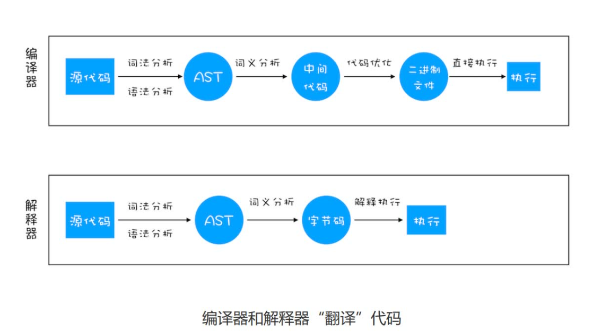

# v8引擎
## 编译器和解释器
机器不能直接理解我们所写的代码，所以在执行程序之前，需要将我们所写的代码“翻译”成机器能读懂的机器语言。语言的执行流程，可以把语言划分为编译型语言和解释型语言。
- 编译型语言在程序执行之前，需要经过编译器的编译过程，并且编译之后会直接保留机器能读懂的二进制文件，这样每次运行程序时，都可以直接运行该二进制文件，而不需要再次重新编译了。比如 C/C++、GO 等都是编译型语言。
- 解释器语言在每次运行时都需要通过解释器对程序进行动态解释和执行。比如 Python、JavaScript 等都属于解释型语言。
解释器和编译器的翻译过程略有不同：

1. 编译型语言的编译过程中，编译器首先会依次对源代码进行词法分析、语法分析，生成抽象语法树（AST），然后是优化代码，最后再生成处理器能够理解的机器码。如果编译成功，将会生成一个可执行的文件。但如果编译过程发生了语法或者其他的错误，那么编译器就会抛出异常，最后的二进制文件也不会生成成功。
2. 在解释型语言的解释过程中，同样解释器也会对源代码进行词法分析、语法分析，并生成抽象语法树（AST），不过它会再基于抽象语法树生成字节码，最后再根据字节码来执行程序、输出结果。

## v8引擎执行代码

V8 在执行过程中既有解释器 Ignition，又有编译器 TurboFan。流程如下：
1. 生成抽象语法树（AST）和执行上下文：
    AST有点类似于DOM树，相当于把代码结构化了。编译器或者解释器后续的工作都需要依赖于 AST，而不是源代码。AST 是非常重要的一种数据结构，Babel的工作原理就是先将源码转换成AST，再转换成语法降级后的AST，最后再利用这个AST生成JS代码。除此之外Eslint也是先将源码转换成AST后再检查代码规范的。
    转换AST流程如下（V8 的编译器前端（如早期的 Full-Codegen、后来的 Ignition 解释器前端）完成）：
    1. 分词（tokenize），又称为词法分析，将一行行的源码拆解成一个个语法上不可能再分的、最小的单个字符或字符串（token）。
    2. 解析（parse），又称为语法分析，将上一步生成的 token 数据，根据语法规则转为 AST。如果源码错误，此时就会抛出错误。
    有了AST，v8引擎接下来就会生成**执行上下文**，执行上下文是 JavaScript 执行一段代码时的运行环境（储存在栈中）。
    在执行之前就进行编译并创建执行上下文一共有三种情况：
    1. 当 JavaScript 执行全局代码的时候，会编译全局代码并创建全局执行上下文，而且在整个页面的生存周期内，全局执行上下文只有一份。
    2. 当调用一个函数的时候，函数体内的代码会被编译，并创建函数执行上下文，一般情况下，函数执行结束之后，创建的函数执行上下文会被销毁。
    3. 当使用 eval 函数的时候，eval 的代码也会被编译，并创建执行上下文。
    全局执行上下文分为变量环境和词法环境
    当v8引擎检测到声明操作时（在函数内部声明的变量是不会被放到全局上下文中的，只有构造该函数的上下文时（执行到该函数了就会构造函数上下文并将这个上下文压入执行栈中）才会被加入）
    - 如果是var声明变量的，会在**变量环境**中创建一个变量属性，并初始化为undefined。
    - 如果是使用let或const声明的全局变量会被放到**词法环境**里，词法环境中的变量在声明前是无法被访问到的，我们称之为"暂时性死区"。而var生命的变量没有这个特性，所以会出现在声明前就可访问而不报错的问题，称为**变量提升**
    - 如果是function定义的函数，它会将函数定义储存在堆中，并在**变量环境**中创建一个函数名的属性，指向堆中的位置。且函数声明的 “提升” 优先级高于 var 变量（即若函数名与 var 变量名相同，函数声明会覆盖 var 的初始值）。声明的对象也类似。
2. 生成字节码
   走完以上流程，解释器 Ignition 就登场了，它会根据 AST生成字节码，并解释执行字节码。
    字节码是一种介于源代码和机器码之间的代码形式，字节码并不是直接运行在物理处理器上的机器码，而是运行在虚拟机上的一种中间代码。字节码需要通过解释器转换成机器码后才能执行。相较于直接将AST转换为机器码而使用大量内存存放转换后的机器码，字节码占用的内存空间小得多。
3. 执行代码
   如果有一段第一次执行的字节码，解释器 Ignition 会逐条解释执行。在执行字节码的过程中，如果发现有热点代码（HotSpot），比如一段代码被重复执行多次，这种就称为热点代码，那么后台的编译器TurboFan 就会把该段热点的字节码编译为高效的机器码，然后当再次执行这段被优化的代码时，只需要执行编译后的机器码就可以了，这样就大大提升了代码的执行效率。所以其执行效率随着执行时间越来越高。
   字节码配合解释器和编译器是最近一段时间很火的技术，称为即时编译（JIT）
   

## 垃圾回收机制
有些数据被使用之后，可能就不再需要了，我们把这种数据称为**垃圾数据**。需要对其进行回收，以释放有限的内存空间。
一般情况下，垃圾回收机制分为，自动回收和手动回收两种：
- C/C++ 就是使用手动回收策略，何时分配内存、何时销毁内存都是由代码控制的，当不再需要这块数据的时候，
就要手动调用 free 函数来释放内存。如果一段数据已经不再需要了，但是又没有主动调用 free 函数来销毁，那么这种情况就被称为**内存泄漏**。
- js使用的是垃圾自动回收机制，产生的垃
圾数据是由垃圾回收器来释放的，并不需要手动通过代码来释放。
### js调用栈中的垃圾回收
有一个记录当前执行状态的指针（称为 ESP）指向调用栈中的执行上下文，表示当前正在执行。当执行完成后JavaScript 会将 ESP下移，这个下移操作就是销毁 函数执行上下文的过程。再调用其他函数时，这块内存就会直接被覆盖掉。
### 堆内存中的垃圾回收
要回收堆中的垃圾数据，就需要用到 JavaScript 中的垃圾回收器了。
#### 代际假说（The Generational Hypothesis）
1. 大部分对象在内存中存在的时间很短，简单来说，就是很多对象一经分配内存，很快就变得不可访问。
2. 不死的对象，会活得更久。
#### 堆内存中的垃圾回收机制
在 V8 中会把堆分为**新生代**和**老生代**两个区域，新生代中存放的是生存时间短的对象，老生代中存放的生存时间久的对象。
新生区通常只支持 1～8M 的容量，老生区支持的容量很大。对于这两块区域，V8 分别使用两个不同的垃圾回收器，以便更高效地实施垃圾回收：
- 副垃圾回收器，主要负责新生代的垃圾回收。
- 主垃圾回收器，主要负责老生代的垃圾回收。
其实主副回收器的回收流程都是一样的：
- 标记空间中活动对象（还在使用的对象）和非活动对象（可以进行垃圾回收的对象）。
- 回收非活动对象所占据的内存。其实就是在所有的标记完成之后，统一清理内存中所有被标记为可回收的对象。
- 内存整理。频繁回收对象后，内存中就会存在大量内存碎片（不连续内存空间）。当内存中出现了大量的内存碎片之后，如果需要分配较大连续内存的时候，就有可能出现内存不足的情况。所以最后一步需要整理这些内存碎
片，但是副垃圾回收器不会产生垃圾碎片，所以没有这个流程。
#### 副垃圾回收器
主要负责新生区的垃圾回收。通常情况下，大多数小的对象都会被分配到新生区，所以说这个区域虽然不大，
但是垃圾回收还是比较频繁的。
新生代中用Scavenge 算法来处理：
把新生代空间对半划分为两个区域，一半是对象区域，
一半是空闲区域，新加入的对象都会存放到对象区域，当对象区域快被写满时，就需要执行一次垃圾清理操作。

垃圾清理时，首先会标记出对象区域中还在使用的对象（一组根元素开始，递归遍历这组根元素，在这个遍历
过程中，能到达的元素称为活动对象，没有到达的元素就可以判断为垃圾数据），然后将这些活动对象复制到空闲区域，最后将对象区域和空闲区域进行交换，这样就完成了一次垃圾回收操作。同时它还会把这些对象有序地排列起来，就相当于完成了内存整理操作，所以复制后空闲区域就没有内存碎片了。

完成复制后，对象区域与空闲区域进行角色翻转，也就是原来的对象区域变成空闲区域，原来的空闲区域变成了对象区域。这样就完成了垃圾对象的回收操作，同时这种角色翻转的操作还能让新生代中的这两块区域无限重复使用下去。

但复制操作的成本很高，所以新生区一般都比较小。所以很容易被存活的对象装满，对此JavaScript 引擎采用了
**对象晋升策略**：当一个对象在新生区中经过两次垃圾回收仍然存活，那么这个对象就会被晋升到**老生区**中去。
#### 主垃圾回收器
主垃圾回收器主要负责老生区中的垃圾回收。除了新生区中晋升的对象，一些大的对象会直接被分配到老生区。因此老生区中的对象有两个特点：
- 对象占用空间大，
- 对象存活时间长。
基于储存的对象特征，主垃圾回收器是采用标记 - 清除（Mark-Sweep）的算法进行垃圾回收的。标记过程同新生代，清理过程就是删掉不可达内存，但这样会产生大量不连续内存，于是又产生了另外一种算法——标记 - 整理（Mark-Compact），标记过程同上，整理过程是让所有存活的对象向一端移动，然后直接清理掉边界以外的内存。
由于需要移动大量存活对象（并更新它们的引用地址），执行成本更高。因此，V8 通常只在内存碎片严重影响分配效率时才会触发标记 - 整理（例如，当分配大对象时发现没有足够的连续内存块）。
#### 全停顿
由于JavaScript 是运行在主线程之上的，一旦执行垃圾回收算法，都需要将正在执行的JavaScript 脚本暂停下来，待垃圾回收完毕后再恢复脚本执行。这种行为叫做（全停顿（Stop-The-World）），全停顿会造成页面卡顿的。为了降低老生代的垃圾回收而造成的卡顿，V8 将标记过程分为一个个的子标记过程，同时让垃圾回收标记和javaScript 应用逻辑交替进行，直到标记阶段完成，这就是**增量标记（Incremental Marking）**算法。

这些小的任务执行时间比较短，可以穿插在其他的 JavaScript 任务中间执行，就不会让用户因为垃圾回收任务而感受到页面的卡顿了。
