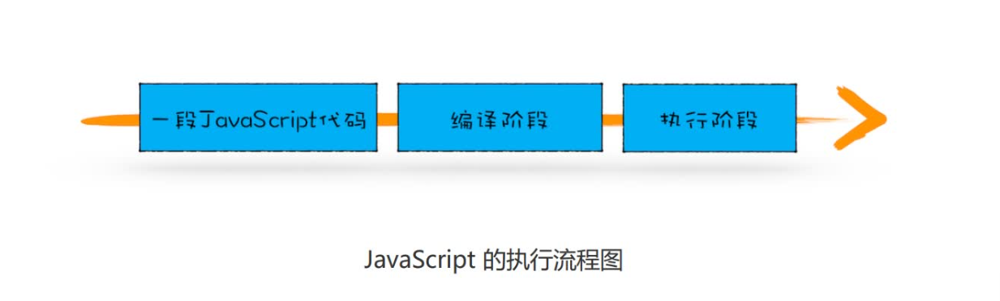
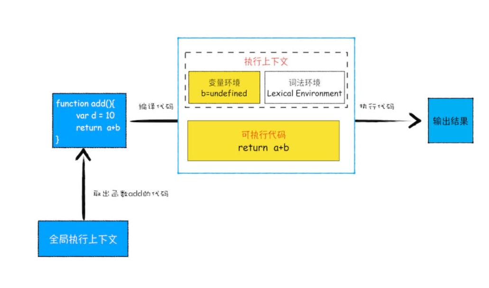

# js代码执行
## js的语言类型
把在使用之前就需要确认其变量数据类型的称为静态语言，在运行过程中需要检查数据类型的语言称为动态语言。
支持隐式类型转换的语言称为弱类型语言，不支持隐式类型转换的语言称为强类型语言。

JavaScript 是一种弱类型的、动态的语言。
## 执行流程

编译完成后，js代码就进入执行阶段。编译阶段会生成执行上下文和可执行代码（字节码），执行阶段就一行一行执行。当遇到函数调用时，就先从全局执行上下文中取出函数代码，然后对这段代码进行编译，并创建该函数的执行上下文和可执行代码。
流程如下：

当有多个执行上下文时，js会通过栈来管理，称为**执行上下文栈**，又称**调用栈**。
- 创建好全局上下文后会压入栈底。
- 全局执行上下文压入到调用栈后，JavaScript 引擎便开始执行全局代码了。
- 再遇见函数时，会调用，JavaScript 引擎会编译该函数，并为其创建一个执行上下文，最后还将该函数的执行上下文压入栈中。
- 执行该函数，完成后从栈顶弹出，并继续执行全局上下文。
- 查找变量时，沿着词法环境的栈顶向下查询，如果在词
法环境中的某个块中查找到了，就直接返回给JavaScript 引擎，如果没有查找到，那么继续在变量环境中查找。
## 作用域链
在每个执行上下文的变量环境中，都包含了外部引用（outer），用来指向外部的执行上下文，引擎在当前执行上下文的词法环境中没有进行查找（包括块级作用域的环境记录），如果未找到，会通过词法环境的外部引用（outer）沿着作用域链向上查找，这个查找的链条就称为**作用域链**，在 JavaScript 执行过程中，作用域链是由词法作用域决定的。
### 词法作用域
词法作用域就是指作用域是由代码中函数声明的位置来决定的，所以词法作用域是静态的作用域，通过它就能够预测代码在执行过程中如何查找标识符。与函数在哪里调用没有关系。
## 闭包
在编译过程中，会对内部函数进行快速的词法扫描，如果判断是一个闭包，会在堆空间创建换一个“closure(foo)”的对象（这是一个内部对象，JavaScript 是无法访的）。
在 JavaScript 中，根据词法作用域的规则，内部函数总是可以访问其外部函数中声明的变量，当通过调用一个外部函数返回一个内部函数后，即使该外部函数已经执行结束了，但是内部函数引用外部函数的变量依然保存在内存中（因为闭包引用的数据实际并不在前面函数的上下文中），我们就把这些变量的集合称为闭包。比如外部函数是 foo，那么这些变量的集合就称为 foo 函数的闭包。（专属背包，除此之外任何地方都无法访问）。
### 闭包回收
闭包使用不正确，会很容易造成内存泄漏。如果引用闭包的函数是一个全局变量，那么闭包会一直存在直到页面关闭；如果这个闭包以后不再使用的话，就会造成内存泄漏。
如果引用闭包的函数是局部变量，函数销毁后，js引擎会回收这块内存
所以使用闭包时应该遵循：如果该闭包会一直使用，那么它可以作为全局变量而存在；但如果使用频率不高，而且占用内存又比较大的话，那就尽量让它成为一个局部变量。

