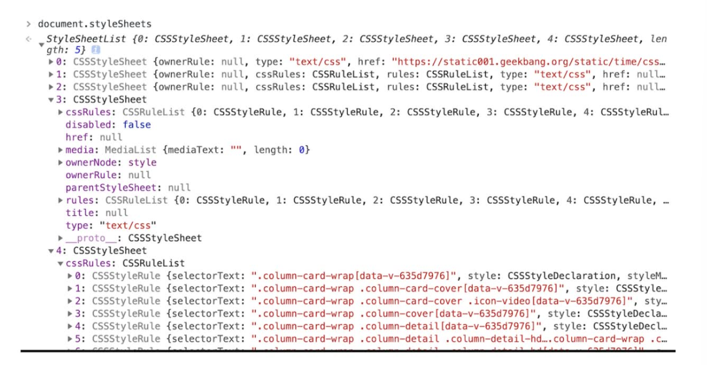

# 页面渲染流程
由于渲染机制过于复杂，所以渲染模块在执行过程中会被划分为很多子阶段，输入的HTML 经过这些子阶段，最后输出像素。我们把这样的一个处理流程叫做渲染流水线。
按照渲染的时间顺序，流水线可分为如下几个子阶段：
构建 DOM 树、样式计算、布局阶段、分层、绘制、分块、光栅化和合成。
- **构建DOM树**
  因为浏览器无法直接理解和使用 HTML，所以需要将HTML 转换为浏览器能够理解的结构——DOM 树。
  输入HTML 文件，网络进程加载了多少数据，HTML 解析器便解析多少数据。最终输出树状结构的 DOM。
  流程如下：
  网络进程接收到响应头之后，会根据响应头中的content-type字段来判断文件的类型，如果是““text/html”，浏览器就会为该请求创建渲染进程，准备好后，网络进程和渲染进程之间会建立一个共享数据的管道，网络进程接收到数据后就通过这个管道传输给渲染进程，渲染进程的HTML解析器会动态接受字节流，并将其解析为DOM。
  - 首先通过分词器将字节流转换为 Token，然后同步进行将 Token 解析为 DOM 节点和将DOM 节点添加到 DOM 树中。
    HTML解析器维护了一个Token栈结构，生成的 
    1. Token 如果是StartTag Token，HTML 解析器会为该 Token 创建一个 DOM 节点，然后将该节点加入到 DOM 树中，它的父节点就是栈中相邻的那个元素生成的节点。
    2. 如果是文本 Token，会生成一个文本节点，然后将该节点加入到DOM 树中，文本 Token 是不需要压入到栈中，它的父节点就是当前栈顶 Token 所对应的 DOM 节点。
    3. 如果是EndTag 标签，HTML 解析器会查看Token 栈顶的元素是否是 StarTag div，如果是，就将 StartTag div 从栈中弹出，表示该 div 元素解析完成。
      
  - 如果遇到JS脚本，HTML 解析器就会暂停 DOM 的解析，JavaScript 引擎介入，并执行 script 标签中的脚本（如果是引入文件就先下载）。
    但是这个下载操作非常耗时，chrome浏览做出的**优化**就包括预操作解析，当渲染引擎收到字节流之后，会开启一个**预解析**线程，用来分析 HTML 文件中包含的 JavaScript、CSS 等相关文件，解析到相关文件之后，预解析线程会提前下载这些文件。另外，也可以使用 CDN 来加速 JavaScript 文件的加载，压缩 JavaScript 文件的体积。如果 JavaScript 文件中没有操作 DOM 相关代码，也可以将该 JavaScript 脚本设置为异步加载，通过 async（一旦加载完成，会立即执行；） 或 defer（DOMContentLoaded 事件之前执行，有序） 来标记代码。
    另外，JS代码也可以操作CSSOM，所以如果代码里引用了外部的 CSS 文件，那么在执行 JavaScript 之前，还需要等待外部的 CSS 文件下载完成，并解析生成 CSSOM 对象之后，才能执行 JavaScript 脚本。由于JS引擎不知道代码是否操作CSSDOM，所以渲染引擎在遇到 JavaScript 脚本时，不管该脚本是否操纵了 CSSOM，都会执行CSS 文件下载，解析操作，再执行 JavaScript 脚本。
    
- **样式计算**
  样式计算的目的是为了计算出 DOM 节点中每个元素的具体样式，这个阶段大体可分为三步来完成：
  1. 当渲染引擎接收到 CSS 文本时，会执行一个转换操作，将 CSS 文本转换为浏览器可以理解的结构——styleSheets。
   
  2. 转换样式表中的属性值，使其标准化，就是将所有值转换为渲染引擎容易理解的、标准化的计算值。
   
  3. 计算出DOM树中每个节点的具体样式：
   根据CSS 的继承规则和层叠规则得到元素最后的样式，应用到DOM节点效果如下：
   
- **布局阶段**
  1. 创建布局树：
   
   在显示之前，我们还要额外地构建一棵只包含可见元素布局树。剔除掉不需要显示的结点。遍历 DOM 树中的所有可见节点，并把这些节点加到布局中。忽略掉不可见的结点。
  2. 布局计算
   得到完整的布局树后，就根据其内容计算布局树的坐标位置。在布局操作的时候，会把布局运算的结果重新写回布局树中。
   **显示器显示图像步骤：**
  显卡合成新的图像，并将图像保存到**后缓存区**中，一旦显卡将合成的图片放到后缓存区中，系统就会让前后缓存区互换。就能保证显示器能读取到最新显卡合成的图像。通常情况下，显卡的更新频率和显示器的刷新频率是一致的。但有时候，在一些复杂的场景中，显卡处理一张图片的速度会变慢，这样就会造成视觉上的**卡顿**。

  **帧**：把渲染流水线生成的每一副图片称为一帧。
  **帧率**：把渲染流水线每秒更新了多少帧称为帧率。
  比如滚动过程中 1 秒更新了 60 帧，那么帧率就是 60Hz 或者 60FPS）。
- **分层**
  将素材分解为多个图层的操作就称为**分层**。
  如果一个页面被划分为两个层，当进行到下一帧的渲染时，上面的一帧可能需要实现某些变换，如平移、旋转、缩放、阴影或者 Alpha 渐变，这时候合成器只需要将两个层进行相应的变化操作就可以了，显卡处理这些操作驾轻就熟，所以这个合成过程时间非常短。

  页面中有很多复杂的效果，如一些复杂的 3D 变换、页面滚动，或者使用 z-indexing做 z 轴排序等，渲染引擎还需要为特定的节点生成专用的图层，并生成一棵对应的**层树（LayerTree）**。通常情况下，并不是布局树的每个节点都包含一个图层，如果一个节点没有对应的层，那么这个节点就从属于父节点的图层。
  如果**拥有层叠上下文属性**（确定位属性的元素、定义透明属性的元素、用 CSS 滤镜的元素等）或者是**需要剪裁（clip）的地方**（比如当文字超出盒子大小时，就产生了剪裁，这时渲染引擎会为文字部分单独创建一个层，如果出现滚动条，滚动条也会被提升为单独的层。）
  
- **图层绘制**
  渲染引擎会把一个图层的绘制拆分成很多小的绘制指令，然后再把这些指令按照顺序组成一个待绘制列表输出。
- **栅格化（raster）操作**
  绘制列表只是用来记录绘制顺序和绘制指令的列表，而实际上绘制操作是由渲染引擎中的合成线程来完成的。当图层的绘制列表准备好之后，主线程会把该绘制列表提交（commit）给合成线程。
  合成线程会将图层划分为图块（tile），就是分块操作（从计算机内存上传到 GPU 内存的操作会比较慢。所以这里也存在优化：在首次合成图块的时候使用一个低分辨率的图片。然后合成器继续绘制正常比例的网页内容，当正常比例的网页内容绘制完成后，再替换掉当前显示的低分辨率内容。）这些图块的大小通常是 256x256或者 512x512，合成线程会按照视口附近的图块来优先生成位图，实际生成位图的操作是由栅格化来执行的。所谓栅格化，是指将图块转换为位图。通常，栅格化过程都会使用 GPU 来加速生成，使用 GPU 生成位图的过程叫快速栅格化，或者 GPU 栅格化，生成的位图被保存在 GPU 内存中。这涉及到了跨进程操作。
  
- **合成和显示**
  一旦所有图块都被光栅化，合成线程（合成操作是在合成线程上完成的，这也就意味着在执行合成操作时，是不会影响到主线程执行的。）就会生成一个绘制图块的命令——“DrawQuad”，然后将该命令提交给浏览器进程。浏览器进程里面有一个叫 viz 的组件，用来接收合成线程发过来的 DrawQuad 命令，然后根据 DrawQuad 命令，将其页面内容绘制到内存中，最后再将内存显示在屏幕上。
  ## 重绘重排和合成
  ### 重排
  
  生成页面的流程如上图，如果改变元素的几何位置属性，浏览器会触发重新布局，解析之后的一系列子阶段，这个过程就叫重排。重排需要更新完整的渲染流水线，所以开销也是最大的。
  ### 重绘
  
  如果修改了元素的背景颜色，那么布局阶段将不会被执行，因为并没有引起几何位置的变换，所以就直接进入了绘制阶段，然后执行之后的一系列子阶段，这个过程就叫重绘，相较于重排操作，重绘省去了布局和分层阶段，所以执行效率会比重排操作要高一些。
  ### 合成
  
  使用了 CSS 的 transform 来实现动画效果，这可以避开重排和重绘阶段，直接在非主线程上执行合成动画操作。这样的效率是最高的，因为是在非主线程上合成，并没有占用主线程的资源，另外也避开了布局和绘制两个子阶段，所以相对于重绘和重排，合成能大大提升绘制效率。
  ## 虚拟DOM
  每次操作DOM 渲染引擎都需要进行重排、重绘或者合成等操作，因为 DOM 结构复杂，所生成的页面结构也会很复杂，对于这些复杂的页面，执行一次重排或者重绘操作都是非常耗时的，这就给我们带来了真正的性能问题。所以我们需要虚拟DOM。
  
  虚拟DOM运行流程如下：
  1. 创建阶段。首先依据 JSX 和基础数据创建出来虚拟 DOM，它反映了真实的 DOM 树的结构。然后由虚拟 DOM 树创建出真实 DOM 树，真实的 DOM 树生成完后，触发渲染流水线往屏幕输出页面。
  2. 更新阶段。当数据发生变化时，重新创建一个新的虚拟 DOM 树，然后将新的虚拟 DOM 树和旧的虚拟 DOM 树进行对比（ Fiber reconciler ，在执行算法的过程中出让主线程），找出差异部分。最后将差异部分更新到真实的 DOM 树上，触发渲染流水线进行页面更新。
### 双缓存
多图形操作都很复杂且需要大量的运算，比如一幅完整的画面，可能需要计算多次才能完成，如果每次计算完一部分图像，就将其写入缓冲区，那么就会造成一个后果，那就是在显示一个稍微复杂点的图像的过程中，你看到的页面效果可能是一部分一部分地显示出来，因此在刷新页面的过程中，会让用户感受到界面的闪烁。而使用双缓存，可以让你先将计算的中间结果存放在另一个缓冲区中，等全部的计算结束，该缓冲区已经存储了完整的图形之后，再将该缓冲区的图形数据一次性复制到显示缓冲区，这样就使得整个图像的输出非常稳定。
虚拟DOM的使用就与上述模式有异曲同工之妙。
### MVC模型

我们可以把虚拟 DOM 看成是 MVC 的视图部分，其控制器和模型都是由Redux 提供的。其具体实现过程如下：
1. 图中的控制器是用来监控 DOM 的变化，一旦 DOM 发生变化，控制器便会通知模型，让其更新数据。
2. 数据更新好之后，控制器会通知视图，告诉它模型的数据发生了变化。
3. 视图接收到更新消息之后，会根据模型所提供的数据来生成新的虚拟 DOM。
4. 新的虚拟 DOM 生成好之后，就需要与之前的虚拟 DOM 进行比较，找出变化的节点。
5. 比较出变化的节点之后，React 将变化的虚拟节点应用到 DOM 上，这样就会触发 DOM节点的更新。
6. DOM 节点的变化又会触发后续一系列渲染流水线的变化，从而实现页面的更新。
