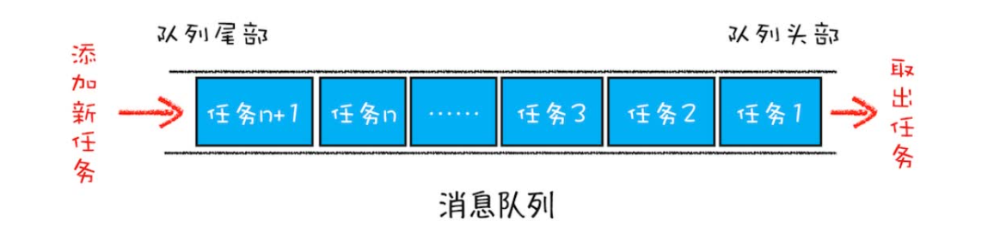
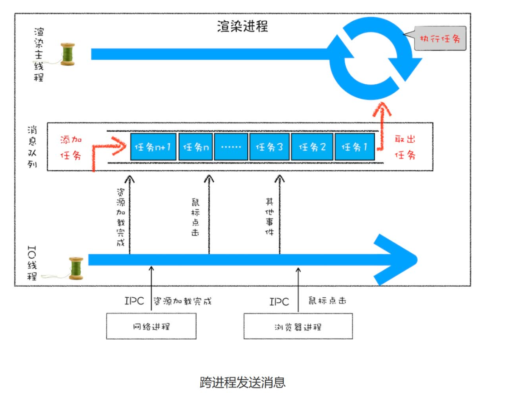
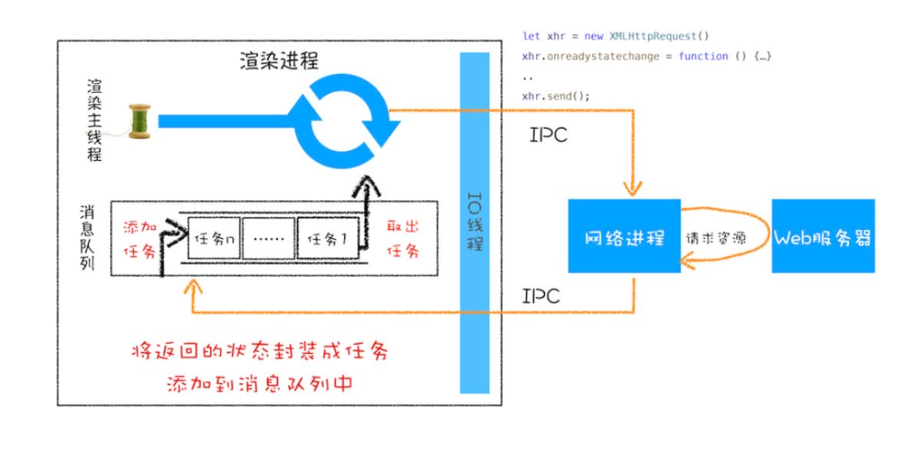
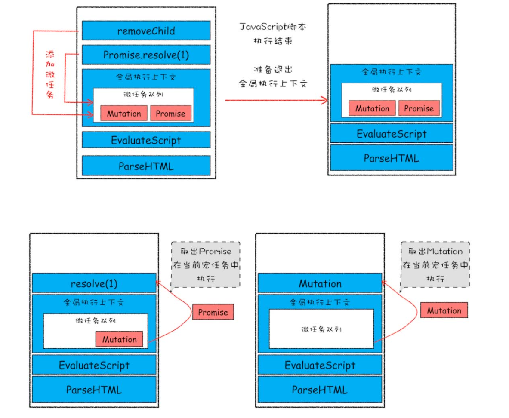
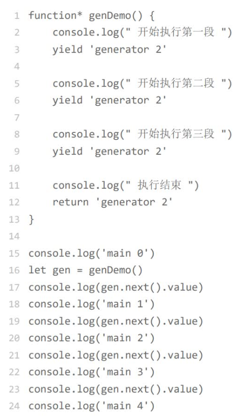
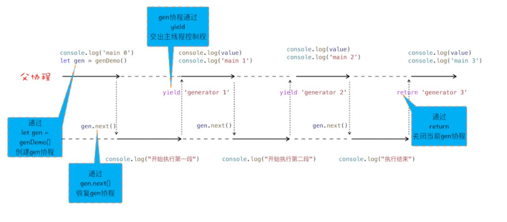
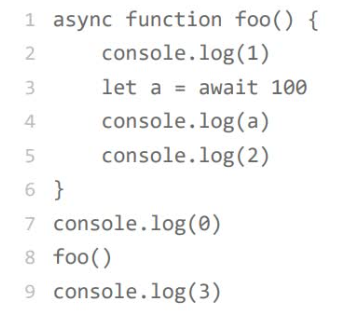
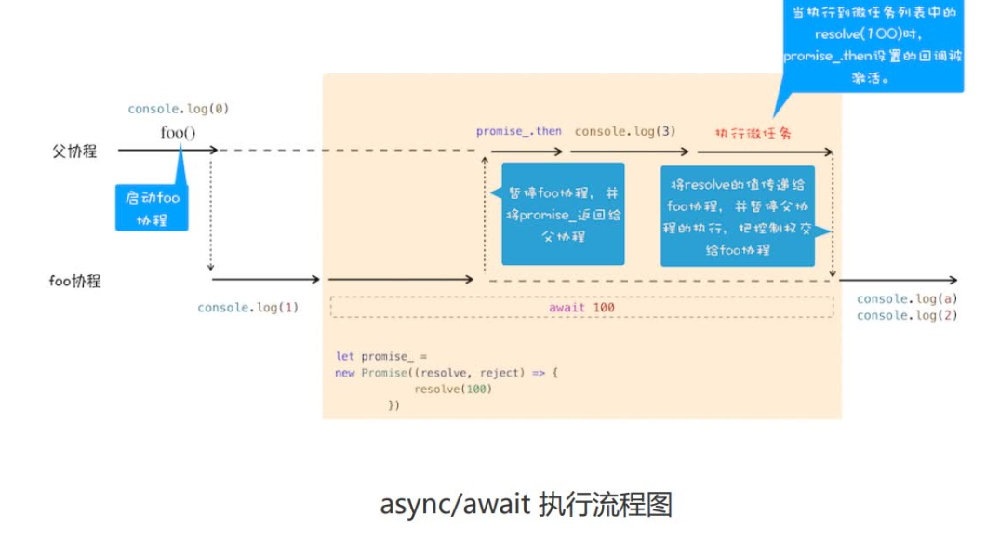
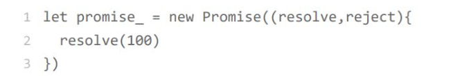
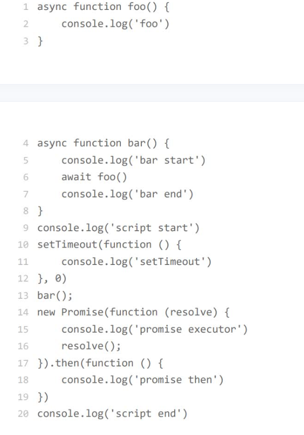

# 页面事件循环
每个渲染进程都有一个主线程，并且主线程非常繁忙，既要处理 DOM，又要计算样式，还要处理布局，同时还需要处理 JavaScript 任务以及各种输入事件。这就需要消息队列和事件循环系统来统筹调度。
单线程只能处理安排好的任务，但大部分情况下任务都是在线程运行过程中产生的。想在线程运行过程中，能接收并执行新的任务，就需要采用**事件循环机制**。

消息队列（先进先出）是一种数据结构，可以存放要执行的任务。渲染进程专门有一个 IO 线程用来接收其他进程传进来的消，接收到消息之后，会将这些消息组装成任务发送给渲染主线程。

确定要退出当前页面时，页面主线程会设置一个退出标志的变量，在每次执行完一个任务时，判断是否有设置退出标志。如果设置了，那么就直接中断当前的所有任务，退出线程。
对于优先级高的任务，比如 DOM 发生变化，采用同步通知的方式，会影响当前任务的执行效率；如果采用异步方 式，又会影响到监控的实时性。于是产生了微任务。
把消息队列中的任务称为**宏任务**，每个宏任务中都包含了一个**微任务队列**，如果 DOM 有变化，那么就会将该变化添加到微任务列表中（解决执行效率问题），等宏任务中的主要功能都直接完成之后，这时候，渲染引擎并不着急去执行下一个宏任务，而是执行当前宏任务中的微任务（解决实时性问题）。
## setTimeout
定时器设置回调函数很特别，需要在指定的时间间隔内被调用，但消息队列中的任务是按照顺序执行的，所以为了保证回调函数能在指定时间内执行，故不能将定时器的回调函数直接添加到消息队列中。
Chrome 中除了正常使用的消息队列之外，还有另外一个消息队列，这个队列中维护了需要延迟执行的任务列表，
包括了定时器和 Chromium 内部一些需要延迟执行的任务。所以当通过 JavaScript 创建一个定时器时，渲染进程会将该定时器的回调任务添加到延迟队列中。
处理完消息队列中的一个任务（当前正在执行的宏任务，以及该宏任务执行过程中产生的所有微任务）之后，会根据发起时间和延迟时间计算出到期的任务，然后依次执行这些到期的任务。等到期的任务执行完成之后，再继续下一个循环过程。
由此，定时器时间会因为很多因素影响导致不准确
1. 当前任务执行时间过久会导致定时器设置的任务被延后执行。因为就算设置时间为0也要等当前任务执行完了才能执行，如果当前任务耗时很长，那会导致定时器事件延后。
2. 如果setTimeout存在嵌套调用5次以上，那么系统判定该函数方法被阻塞了，如果定时器调用时间小于4ms，会设置最短时间间隔为4ms，所以一些实时性较高的需求就不适合使用 setTimeout。
3. 激活的页面，setTimeout执行最小间隔是1000毫秒，如果标签不是当前的激活标签，那么定时器最小的时间间隔是 1000 毫秒，目的是为了优化后台页面的加载损耗以及降低耗电量。
4. 延时执行时间有最大值：Chrome、Safari、Firefox 都是以 32 个 bit 来存储延时值的，32bit 最大只能存放的数字是 2147483647 毫秒，这就意味着，如果 setTimeout 设置的延迟值大于 2147483647 毫秒（大约 24.8 天）时就会溢出，这导致定时器会被立即执行。
## XMLHttpReques
将一个函数作为参数传递给另外一个函数，那作为参数的这个函数就是**回调函数**。
如果回调函数 callback 是在主函数**返回之前**执行的，我们把这个回调过程称为**同步回调**。
回调函数在主函数外部执行的称为**异步回调**。
对于异步回调，一般有两种方式：
1. 把异步函数做成一个任务，添加到信息队列尾部。
2. 把异步函数添加到微任务队列中，这样就可以在当前任务的末尾处执行微任务了。
工作流程如下：

## 宏任务
为了协调这些任务有条不紊地在主线程上执行，页面进程引入了消息队列和事件循环机制，渲染进程内部会维护多个消息队列，比如延迟执行队列和普通的消息队列。然后主线程采用一个 for 循环，不断地从这些任务队列中取出任务并执行任务。我们把这些消息队列中的任务称为**宏任务**。
但是，宏任务的时间粒度比较大，执行的时间间隔是不能精确控制的，消息队列中有可能被插入很多系统级的任务。对一些高实时性的需求就不太符合，所以产生了微任务。
## 微任务
**微任务**就是一个需要异步执行的函数，执行时机是在主函数执行结束之后、当前宏任务结束之前。
产生微任务的方式有如下几种：
1. 使用 MutationObserver 监控某个 DOM 节点，然后再通过 JavaScript 来修改这个节点，或者为这个节点添加、删除部分子节点，当 DOM 节点发生变化时，就会产生 DOM 变化记录的微任务。
2. 使用 Promise，当调用 Promise.resolve() 或者 Promise.reject() 的时候，也会产生微任务。
在当前宏任务中的 JavaScript 快执行完成时，也就在 JavaScript 引擎准备退出全局执行上下文并清空调用栈的时候，JavaScript 引擎会检查全局执行上下文中的微任务队列，然后按照顺序执行队列中的微任务。
如果在执行微任务的过程中，产生了新的微任务，同样会将该微任务添加到微任务队列中，V8 引擎一直循环执行微任务队列中的任务，直到队列为空才算执行结束。也就是说在执行微任务过程中产生的新的微任务并不会推迟到下个宏任务中执行，而是在当前的宏任务中继续执行。

## MutationObserver 
MutationObserver 等多次 DOM 变化后，一次触发异步调用（一次性通知DOM变化，但是DOM该渲染还是会渲染，这块并没有优化，可以通过虚拟优化节约更新DOM的性能），并且还会使用一个数据结构来记录这期间所有的 DOM 变化。这样即使频繁操作DOM，也不会对性能造成太大的影响。在每次 DOM 节点发生变化的时候，渲染引擎将变化记录封装成微任务，并将微任务添加进当前的微任务队列中。这样当执行到检查点的时候，V8引擎就会按照顺序执行微任务了。
## async和await
### 生成器
生成器函数是一个带星号函数，而且是可以暂停执行和恢复执行的。

1. 生成器函数内部执行一段代码，如果遇到 yield 关键字，那么 JavaScript 引擎将返回关键字后面的内容给外部，并暂停该函数的执行。
2. 外部函数可以通过 next 方法恢复函数的执行。
### 协程
**协程**是一种比线程更加轻量级的存在，可以把协程看成是跑在线程上的任务，一个线程上可以存在多个协程，但是在线程上同时只能执行一个协程，比如当前执行的是 A 协程，要启动 B 协程，那么 A 协程就需要将主线程的控制权交给 B 协程，这就体现在 A 协程暂停执行，B 协程恢复执行；同样，也可以从 B 协程中启动 A 协程。通常，如果从 A 协程启动 B 协程，我们就把 A 协程称为B 协程的**父协程**。
协程不是被操作系统内核所管理，而完全是由程序所控制（也就是在用户态执行）。这样带来的好处就是性能得到了很大的提升，不会像线程切换那样消耗资源。

当在 gen 协程中调用了 yield 方法时，
JavaScript 引擎会保存 gen 协程当前的调
用栈信息，并恢复父协程的调用栈信息。同样，当在父协程中执行 gen.next 时，JavaScript 引擎会保存父协程的调用栈信息，并恢复 gen 协程的调用栈信息。
我们可以把执行生成器的代码封装成一个函数，这个执行生成器代码的函数称为**执行器**。
### async
async 是一个通过**异步执行**并**隐式返回 Promise**作为结果的函数。
### await
以这段代码为例：

1. 首先执行console.log(0)这个语句，打印出来 0。
2. 然后进入foo函数，由于被 async 标记过的，所以当进入该函数的时候，JavaScript 引擎会保存当前的调用栈等信息，然后执行 foo 函数中的console.log(1)语句，并打印出 1。
3. 然后执行到await 100时，会默认创建一个 Promise 对象：
   
   调用了resolve函数，所以将该任务提交给微任务队列。（await后的语句包装成一个微任务与这个resolve的回调函数相关联并放入为任务队列，因为此处立刻决议了）
4. JavaScript 引擎会暂停当前协程的执行，将主线程的控制权转交给父协程执行，同时会将 promise_ 对象返回给父协程。
5. 父协程调用 promise_.then 来监控 promise 状态的改变。
6. 接下来继续执行父协程的流程，执行console.log(3)，并打印出来 3。
7. 父协程将执行结束，进入微任务检查点，执行微任务队列。resolve(100)的任务等待执行结束，执行到这里的时候，会触发 promise_.then 中的回调函数，这个回调函数就是await后面的代码，主线程将控制权交给foo协程，并将value值传给协程。
8. foo 协程继续执行后续语句，执行完成之后，将控制权归还给父协程。

首先执行同步代码，打印script start，然后遇见一个setTimeout，将他的回调函数放入延时消息队列，然后开始执行bar函数，因为有async标记，记录其上下文环境，执行同步代码打印bar start，再执行foo里面代码，打印foo,给主协程返回一个微任务，又遇见了promise，先执行代码打印promise executor，再将resolve回调函数放入当前任务的微任务队列，再打印script end，此时宏任务已经执行完毕，于是进入微任务，先是进入bar协程，打印bar end，再执行第二个微任务，打印promise then，微任务队列清空，执行延时队列代码打印setTimeout。